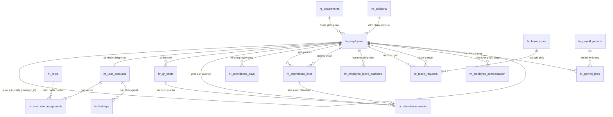

# HR Management with AI Project

Khi nháp đang hỏi lý do, câu trả lời chỉ điền lý do và giữ nguyên ngày, buổi, lượt công và giờ đã chọn. Với câu nhập gộp, phần sau “lý do/vì” không dùng để suy ra các trường khác. Upload PDF từ chối XFA và action bị cấm trong form, bookmark hoặc cấu trúc lồng nhau; bookmark nội bộ an toàn vẫn được chấp nhận.

Gemini mặc định tắt (`GEMINI_ENABLED=false`), kể cả khi đã cấu hình API key. Fallback, tra cứu tài liệu và báo cáo hoạt động không cần Gemini. Khi chủ động bật, classifier gửi tối đa 600 ký tự đã che dữ liệu cá nhân, nguồn policy tối đa 4.000 ký tự; đầu ra giới hạn 128 token cho phân loại, 256 token cho filter báo cáo hoặc 384 token cho trích nguồn. Không tự retry; lỗi provider dùng fallback hoặc mẫu lỗi hiện hữu.


Tài liệu thiết kế và định hướng kiến trúc hệ thống quản lý nhân sự, chấm công QR, tính lương và Trợ lý ảo AI nội bộ của Group 3 HCM.

Theo dõi phạm vi và bằng chứng còn thiếu tại [AI acceptance](docs/AI_ACCEPTANCE.md). ReportRun POST mặc định SELF cho báo cáo thông thường; HEADCOUNT dùng DIRECT_REPORTS/COMPANY theo role, approval queue chỉ DIRECT_REPORTS. Tài khoản chưa gắn employee không được SELF/DIRECT_REPORTS. Đọc run FAILED không đổi trạng thái thành EXPIRED. Nháp nghỉ kiểm số dư theo năm của ngày nghỉ, không lấy nhầm năm hiện tại khi qua giao năm.

Contracts frontend dùng chung tại `frontend/src/types/ai.ts` và `reports.ts`; action có union theo action_type. Suggestion trả default_inputs từ cùng resolver dùng khi thực thi; input khởi tạo nháp/report được kiểm theo allowlist và quyền. Fallback gợi ý lọc theo actor đã đăng nhập, không giả định mọi tài khoản có employee. Lỗi tải blob PDF/XLSX đọc envelope JSON; hết phiên chuyển login kèm thông báo cố định, giữ ngoại lệ kiosk.

Migration `d9e0f1a2b3c4` thêm currency_code vào PayrollLine snapshot. Tính lương mới chép mã từ hồ sơ nguồn; report/Excel tách từng currency, không quy đổi. Legacy giữ NULL vì chưa lưu mã tại thời điểm tính: báo cáo từ chối với PAYROLL_CURRENCY_UNAVAILABLE cho tới khi HR xác minh, không tự gán VND từ hồ sơ hiện tại. Công thức lương/thuế hiện hữu không thay đổi; đây là lưu/xuất snapshot, không bổ sung cách tính lương quốc tế.

ReportRun lưu `GENERATING → READY/FAILED` bằng giao dịch riêng; chỉ READY sau khi lưu cả snapshot và XLSX. Phạm vi nhân viên được chốt trước truy vấn, giao với quyền hiện thời; preview/download kiểm lại toàn bộ phạm vi. Lịch sử hiển thị lỗi thất bại bằng mã an toàn, không chứa chi tiết DB hoặc đường dẫn private. Cleanup mặc định chỉ xem trước; `--apply` dọn artifacts hết hạn và giữ trạng thái FAILED trong lịch sử 30 ngày. Luồng DB thực tế vẫn cần nghiệm thu.

Ba gợi ý tra cứu quy định dùng kiến thức đã công bố; nếu nguồn đã bị thu hồi hoặc không còn phù hợp, trả `KNOWLEDGE_NOT_FOUND` và không gọi Gemini. Tra cứu chính sách theo quyền không yêu cầu tài khoản phải liên kết hồ sơ nhân viên.

Yêu cầu báo cáo tự do có nháp `DRAFT_REPORT` theo owner/revision/TTL: hỏi loại → kỳ → phạm vi còn thiếu, đưa nút chọn từ catalog được cấp quyền và kiểm lại quyền từng lượt. Kỳ hỗ trợ tháng này/tháng trước, tháng số/năm hoặc hai ngày ISO; lương yêu cầu trọn tháng. Gợi ý có sẵn giữ mặc định minh bạch; khi đủ dữ liệu, chatbot tạo ReportRun thật và mở preview/XLSX bằng run_id. Shortcut truyền cả bộ lọc phòng ban; lượt chat mới vô hiệu hóa action cũ.

Lỗi API AI/knowledge/reports trả envelope `code/message/message_code/request_id/action=null/sources=[]`, giữ HTTP status và mã `detail` tương thích. Thông báo theo catalog cố định; validation không trả lại prompt/input, lỗi hệ thống không lộ DB/file path. Header `X-Request-ID` do server tạo, dùng cùng ID với audit; `Retry-After` được giữ khi hạn mức. Chat cho phép chỉ gửi suggestion_id hoặc inputs của nháp; mọi lượt dùng draft_id bắt buộc có draft_revision.

Tham khảo của gợi ý soạn/duyệt phép trỏ LEAVE.REQUEST; báo cáo cá nhân trỏ REPORT.CATALOG, phạm vi nhóm trỏ REPORT.ACCESS. Ba PDF demo có mục lục, bookmark theo section_code và số trang; PDF báo cáo mô tả đủ bảy loại và thao tác preview/Excel. File report hết hạn của chính owner trả 410 REPORT_EXPIRED; UUID ngoài owner vẫn 404.

Cleanup CLI cũng dọn artifacts UUID không còn được bất kỳ run nào tham chiếu sau hai giờ và metadata hết hạn quá 30 ngày khi có --apply. Scan không đụng file mới, file được tham chiếu, symlink hoặc tên ngoài định dạng server. Bản thảo Markdown của ba PDF được generator ghi trong `docs/knowledge-drafts` để team rà nội dung trước công bố.

> 📚 **Tài liệu kỹ thuật chuyên sâu:**
> - 🏛️ **Kiến trúc phần mềm chi tiết (SAD):** [docs/ARCHITECTURE.md](docs/ARCHITECTURE.md)
> - 🚀 **Hướng dẫn cài đặt & vận hành (Setup Guide):** [docs/SETUP_GUIDE.md](docs/SETUP_GUIDE.md)
> - **Luồng AI:** [AI Copilot](docs/AI_COPILOT.md) — kiến trúc, công cụ, phân quyền và giới hạn kiểm chứng hiện tại.

Khi thêm hoặc thay đổi tính năng, agent cập nhật đồng bộ README, ARCHITECTURE và SETUP_GUIDE trong cùng phần việc để team cùng follow; nội dung đã triển khai và kế hoạch phải được phân biệt rõ.

---

## 1. Mục tiêu và Quy định nghiệp vụ cốt lõi

Xây dựng ứng dụng web nội bộ hỗ trợ doanh nghiệp quản lý hồ sơ nhân sự, ghi nhận chấm công bằng thẻ QR tĩnh qua Kiosk Web, xử lý giải trình chấm công, quản lý đơn nghỉ phép theo buổi/ngày, tính lương tự động theo luật Việt Nam và tích hợp Trợ lý ảo AI hỗ trợ nhân viên tra cứu, thao tác nhanh.

Hệ thống áp dụng cho **một văn phòng/chi nhánh duy nhất**, không chia ca và không vận hành đa chi nhánh.

### 1.1 Lịch làm việc & Ngày công chuẩn
- **Giờ làm việc hành chính:** Cố định từ **08:00 đến 17:00**, từ Thứ Hai đến Thứ Sáu. Không làm việc Thứ Bảy và Chủ Nhật.
- **Thời gian nghỉ trưa:** Từ **12:00 đến 13:00** (1 tiếng, không tính vào giờ làm việc).
- **Ngày công chuẩn:** **8 tiếng / ngày** (tương đương 1.0 công).

### 1.2 Quy định chấm công QR & Xử lý quên quét thẻ
- **Thẻ QR:** Mỗi nhân viên được cấp một thẻ vật lý tĩnh mang mã token hash an toàn, không thay đổi theo thời gian.
- **Kiosk chấm công:** Chạy trực tiếp trên trình duyệt Web (online kết nối server), quét nhận diện lượt vào (`CHECK_IN`) và ra (`CHECK_OUT`).
- **Xử lý quên quẹt thẻ:**
  - Nhân viên phát hiện thiếu lượt vào/ra cần nộp yêu cầu **Giải trình chấm công** trên hệ thống.
  - **Hạn chốt giải trình:** Giải trình phải được gửi và được Quản lý duyệt **trước ngày chốt công cuối tháng**.
  - **Mất công:** Mọi trường hợp thiếu lượt vào hoặc ra mà không được duyệt giải trình kịp trước ngày chốt tháng xem như **mất ngày công và không được tính lương**.

### 1.3 Chính sách nghỉ phép & Hạn mức phép năm
- **Hình thức nghỉ:**
  - **Nghỉ một buổi:** Buổi sáng (`MORNING`: 08:00 - 12:00, tính 0.5 ngày công) hoặc Buổi chiều (`AFTERNOON`: 13:00 - 17:00, tính 0.5 ngày công).
  - **Nghỉ cả ngày:** Cả ngày (`FULL_DAY`: 08:00 - 17:00, tính 1.0 ngày công).
- **Hạn mức phép năm (Annual Leave Quota):** Mỗi nhân viên có số ngày nghỉ hưởng nguyên lương nhất định trong năm (`total_entitled_days`).
- **Hết hạn cuối năm:** Số ngày phép chưa dùng hết trong năm sẽ **tự động hết hạn vào ngày 31/12**, không bảo lưu hay chuyển sang năm sau.
- **Nghỉ không lương:** Khi nhân viên đã sử dụng hết hạn mức ngày phép hưởng lương, các đơn xin nghỉ tiếp theo bắt buộc phải chọn loại **Nghỉ không hưởng lương (`UNPAID_LEAVE`)**.

### 1.4 Quy định ngày nghỉ lễ (Holidays)
- Danh mục ngày lễ trong năm được cấu hình trên hệ thống bởi vai trò **ADMIN** hoặc **HR**.
- **Quyền lợi:** Vào các ngày lễ, nhân viên được **tính đủ ngày công hưởng nguyên lương** mà **không cần phải chấm công**.
- **Ràng buộc:** Không cho phép chỉnh sửa hoặc xóa ngày nghỉ lễ nếu ngày đó đã trôi qua trong quá khứ (`holiday_date < CURRENT_DATE`).

### 1.5 Cơ chế phê duyệt
- **Quản lý trực tiếp (`manager_employee_id`)** của nhân viên là người duy nhất có thẩm quyền duyệt hoặc từ chối:
  1. Đơn giải trình bổ sung chấm công.
  2. Đơn xin nghỉ phép (hưởng lương và không lương).
- Quy trình phê duyệt diễn ra độc lập, **không cần thông qua HR duyệt**.

### 1.6 Kỳ tính công, Lương và Thuế
- **Kỳ tính công & lương:** Chạy từ **ngày 01 đến ngày cuối cùng của tháng**.
- **Mức lương căn bản:** Tính theo mức **lương GROSS ký trên hợp đồng lao động**, do HR thiết lập và quản lý lịch sử điều chỉnh trên hệ thống.
- **Ngày công chuẩn trong tháng:** Tổng số ngày trong tháng trừ đi các ngày Thứ Bảy, Chủ Nhật; bao gồm cả các ngày nghỉ lễ hưởng nguyên lương.
- **Trích đóng bảo hiểm bắt buộc:** Thực hiện theo luật lao động hiện hành của Việt Nam trên mức lương GROSS đóng bảo hiểm:
  - BHXH: **8%**
  - BHYT: **1.5%**
  - BHTN: **1%**
- **Thuế Thu nhập cá nhân (TNCN):** Tính sau khi giảm trừ các khoản bảo hiểm bắt buộc, áp dụng giảm trừ gia cảnh (bản thân & người phụ thuộc) và biểu thuế lũy tiến từng phần theo luật Việt Nam.
- **Xuất bảng lương:** Hỗ trợ kết xuất bảng lương chi tiết ra file **Excel/PDF** sau khi đã hoàn tất tính toán và chốt kỳ lương tháng (`CLOSED`).

---

## 2. Yêu cầu kỹ thuật

### Kiến trúc công nghệ đề xuất
- **Frontend:** React + TypeScript + Ant Design; giao diện desktop-first cho HR/Quản lý, responsive linh hoạt cho nhân viên tra cứu và tương tác.
- **Backend:** Python 3.12+, FastAPI, Pydantic v2; RESTful API chuẩn `/api/v1`.
- **Database & Migration:** PostgreSQL (lưu trữ timezone UTC, nghiệp vụ theo `Asia/Ho_Chi_Minh`), SQLAlchemy 2.x (Async ORM) và Alembic quản lý migration.
- **Trí tuệ nhân tạo (AI):** Tích hợp Gemini API / LLM với kỹ thuật **Function Calling (Tool Use)** và **RAG (Retrieval-Augmented Generation)** để tra cứu chính sách và tự động tạo đơn.
- **Kiểm thử & Triển khai:** pytest, pytest-asyncio; Docker, Docker Compose; biến môi trường `.env` tách biệt secrets.

### Nguyên tắc kỹ thuật và bảo mật
- **Tách lớp kiến trúc:** Router $\rightarrow$ Service nghiệp vụ $\rightarrow$ Repository $\rightarrow$ Database Model; tách biệt Schema Pydantic cho Request/Response.
- **Xác thực & Phân quyền (RBAC):** Token JWT, hỗ trợ 4 vai trò chính: `ADMIN`, `HR`, `MANAGER`, `EMPLOYEE`. Danh tính lấy trực tiếp từ token, ngăn chặn giả mạo `employeeId`.
- **Bảo mật thẻ QR & Chấm công:** Token thẻ QR được sinh ngẫu nhiên dạng chuỗi opaque, CSDL chỉ lưu chuỗi hash (SHA-256). Kiosk Web gửi request có kèm token xác thực thiết bị và `idempotency_key` chống quét lặp.
- **Bảo vệ toàn vẹn dữ liệu:** Nhật ký quét gốc (`hr_attendance_events`) là append-only, tuyệt đối không chỉnh sửa hay xóa. Điều chỉnh công luôn sinh ra event mới có liên kết giải trình đã duyệt.
- **Độ chính xác tài chính:** Mọi trường liên quan đến tiền tệ dùng kiểu `DECIMAL(18, 2)`, không dùng số thực dấu phẩy động.

---

## 3. Danh sách tính năng chi tiết

### 3.1 Quản lý nhân sự & Cơ cấu tổ chức
- Quản lý hồ sơ nhân viên: Thông tin cá nhân, liên hệ, ngày sinh, ngày vào làm/nghỉ việc, trạng thái (`ACTIVE`, `INACTIVE`, `TERMINATED`).
- Quản lý phòng ban và chức vụ, gán Quản lý trực tiếp (`manager_employee_id`) cho từng nhân viên.
- Quản lý tài khoản đăng nhập (`hr_user_accounts`), gán vai trò quyền hạn RBAC.

### 3.2 Cấu hình ngày lễ (Holidays)
- ADMIN/HR thêm, xem danh sách ngày nghỉ lễ hưởng nguyên lương trong năm.
- Hệ thống tự động ghi nhận ngày lễ vào ngày công hưởng lương khi tính lương tháng.
- Khóa không cho chỉnh sửa/xóa đối với ngày lễ đã diễn ra (`holiday_date < CURRENT_DATE`).

### 3.3 Chấm công QR & Giải trình ngày công
- HR phát hành, thu hồi hoặc cấp lại thẻ QR tĩnh cho nhân viên (in thẻ hoặc lưu ảnh QR bảo mật).
- Màn hình Kiosk Web đặt tại văn phòng: Nhân viên quét mã QR trước camera/máy quét để Check-in hoặc Check-out.
- Bảng công theo dõi trực quan: Tự động tổng hợp giờ vào đầu tiên, giờ ra cuối cùng, số phút làm việc và cảnh báo thiếu lượt quét.
- Nhân viên gửi đơn giải trình ngày công (chọn ngày, loại lượt bổ sung, thời gian đề xuất, lý do).
- Quản lý trực tiếp duyệt/từ chối giải trình. Duyệt trước hạn chốt tháng sẽ phục hồi ngày công tương ứng.

### 3.4 Quản lý nghỉ phép & Số dư phép năm
- Nhân viên gửi đơn nghỉ phép: Chọn loại nghỉ (Phép năm `ANNUAL`, Nghỉ không lương `UNPAID`, Nghỉ ốm `SICK`), chọn buổi (`MORNING` 4h, `AFTERNOON` 4h, hoặc `FULL_DAY` 8h).
- Quản lý trực tiếp tiếp nhận thông báo và phê duyệt đơn trực tuyến.
- Quản lý số dư phép năm (`hr_employee_leave_balances`):
  - Hiển thị tổng ngày phép, số ngày đã nghỉ, số ngày còn lại.
  - Hết phép năm tự động yêu cầu chuyển sang nghỉ không lương.
  - Reset/hết hạn số dư phép vào cuối năm.

### 3.5 Quản lý hồ sơ lương & Bảng lương tháng
- HR cấu hình mức lương GROSS và phụ cấp cố định theo thời gian (`hr_employee_compensation`).
- Khởi tạo kỳ lương tháng (từ ngày 01 đến ngày cuối tháng):
  - Tự động quét dữ liệu chấm công thực tế, ngày lễ và ngày nghỉ phép đã duyệt.
  - Tính toán số ngày công chuẩn và ngày công hưởng lương thực tế.
  - Tự động tính khấu trừ bảo hiểm (BHXH, BHYT, BHTN) và thuế TNCN theo luật Việt Nam.
  - Cho phép HR rà soát, ghi chú điều chỉnh bổ sung và chốt kỳ lương (`CLOSED`).
- Kết xuất bảng lương tháng ra file **Excel** chuẩn cho kế toán và gửi phiếu lương cá nhân cho nhân viên.

### 3.6 Trợ lý AI nội bộ


**Luồng AI chatbox:** dùng cùng chat cho số dư phép/chấm công, nháp nghỉ phép/giải trình, hàng đợi duyệt, chính sách/tài liệu và bảy template báo cáo. Python nhận dạng ngày/bộ lọc phổ biến, tổng hợp DB theo JWT và kiểm tra nghiệp vụ. Gemini chỉ hỗ trợ câu khó và gợi ý tham số theo schema đóng; không có kết nối SQL.

- Hỏi số dư phép: trả dữ liệu thực tế của người đăng nhập, kèm chính sách published còn hiệu lực và đúng quyền nếu tìm được nguồn. Chấm công chỉ phản ánh bản ghi hiện có trong kỳ đã chọn.
- Soạn đơn: giữ ngày/loại đã nhận dạng, hỏi phần thiếu; thiếu phép năm cảnh báo sớm. Người dùng chọn loại khác đang hoạt động, không tự đổi sang không lương. Hỏi số dư trong khi soạn vẫn giữ nháp. Gửi đơn qua form và quản lý trực tiếp.
- Báo cáo: yêu cầu trong chat → hỏi kỳ/phạm vi thiếu → tạo snapshot/template → preview bảng và Tải Excel → Chỉnh qua chat để tạo snapshot mới. Không có tab/trang báo cáo hoặc lịch sử tải. Route /reports cũ mở chat; API giữ tương thích. Khi mở snapshot mới, preview bắt đầu ở trang 1. Yêu cầu lương tháng này dùng trọn tháng, kể cả loại báo cáo do intent dispatch xác định.
- Tài liệu: HR/ADMIN kéo thả PDF, mặc định lưu nháp cho nhân viên; giới hạn người đọc là tùy chọn. Tên từ file, section/trang tự tạo. Mỗi lần tải mới tăng phiên bản, cần kiểm tra preview rồi công bố.

Kiến trúc và điểm mở rộng: [AI chatbox](docs/AI_COPILOT.md), [Architecture](docs/ARCHITECTURE.md#kiến-trúc-ai-chatbox-và-công-cụ). Cấu hình và nghiệm thu: [Setup](docs/SETUP_GUIDE.md#kiểm-tra-flow-ai-chatbox).


Gợi ý chat được thu gọn trong menu “Gợi ý câu hỏi”; khi soạn nháp chỉ hiện lựa chọn cần thiết cho bước hiện tại.


Chat nhận ngày dạng “10 08 2026”, “ngày mốt”, “thứ 3 tuần sau”, “thứ 2 tuần trước” và ngày cụ thể trong tháng sau. Khi Python chưa nhận được ngày, Gemini hỗ trợ text-to-date nếu đã bật; chỉ gửi từ vựng ngày tối đa 200 ký tự và ngày hiện tại ở Việt Nam, không gửi lịch sử/DB/lý do. Ngày không rõ hoặc lỗi provider vẫn cần hỏi lại. Yêu cầu đầu tiên giữ loại phép/ngày đã nêu và hỏi gộp buổi nghỉ với lý do còn thiếu. Dialog vừa viewport; thao tác điều hướng là nút có tên, nháp đơn hiển thị thông tin trước khi mở form.

Màn hình báo cáo tải bảng theo bộ lọc mặc định, có nút áp dụng bộ lọc và “Tải về ▾” cho Excel/CSV từ cùng snapshot đang xem. Chọn phòng ban theo tên, kỳ lương theo tháng; không hiển thị lịch sử tải trên màn hình. Bảng cố định cột nhận diện, cuộn ngang/dọc và phân trang; dữ liệu rỗng vẫn giữ tiêu đề cột. Bảy template Excel có tiêu đề theo nghiệp vụ, ngày/giờ Việt Nam, format số, bảng có bộ lọc và bố cục in A4; dữ liệu không được tính lại khi định dạng.


Phản hồi chat và mỗi mục lịch sử dùng chung giới hạn 8.000 ký tự để phản hồi RAG dài vẫn hợp lệ ở lượt kế tiếp; câu hỏi mới tối đa 2.000 ký tự, lịch sử tối đa 12 mục. RAG yêu cầu nội dung đoạn trích khớp ít nhất 35% token câu hỏi; tiêu đề chỉ tăng điểm xếp hạng. Kiểm tra PDF duyệt các action theo sự kiện trong `/AA` và chuỗi `/Next`, gồm mảng và tham chiếu gián tiếp, có chống vòng lặp.

`POST /api/v1/ai/chat` lấy danh tính và role từ JWT; schema từ chối field lạ như `employee_id`, `roles` và system-role trong history. Các intent hiện có tra số dư phép/công đã ghi, tạo nháp phép hoặc giải trình, và tìm trích đoạn trong tài liệu knowledge đã publish. Nháp nhiều lượt gắn với user đăng nhập, chỉ chứa trường được allowlist, hết hạn sau 15 phút và chỉ mở form để người dùng kiểm tra/gửi; chatbot không tự tạo bản ghi nghiệp vụ.

Bảy loại báo cáo ATTENDANCE, LEAVE, ATTENDANCE_FIX, APPROVAL_QUEUE, HEADCOUNT, MY_PAYSLIP và PAYROLL_SUMMARY có JSON/CSV/XLSX từ dữ liệu thật, với `private, no-store`. Bảy template `.xlsx` v1 nằm trong `backend/app/report_templates`; workbook có sheet thông tin/dữ liệu/tổng hợp, chống formula injection và lưu tiền vượt 15 chữ số dưới dạng text chính xác. Giới hạn 10.000 dòng, vượt giới hạn yêu cầu thu hẹp bộ lọc. `POST /api/v1/reports/runs` lưu preview và XLSX private trong 1 giờ; chỉ chủ sở hữu xem/tải, có kiểm lại quyền/scope. Script `backend/scripts/cleanup_expired_report_runs.py` dọn artifacts hết hạn. Nhân viên dùng SELF; quản lý dùng SELF/DIRECT_REPORTS; HR/ADMIN dùng COMPANY với loại report được cấp quyền. Bộ lọc phòng ban chỉ thu hẹp dữ liệu. Phiếu lương chỉ SELF; tổng hợp lương chỉ HR/ADMIN, theo phòng ban hiện tại, kỳ trọn tháng APPROVED/CLOSED. Report đọc currency snapshot, tách tổng theo tiền tệ và không tính lại lương khi export; legacy thiếu currency cần HR xác minh. Chatbot lấy gợi ý có link section PDF theo role; shortcut mở đúng form/tab, không tự gửi hoặc duyệt đơn. DB/browser integration còn cần kiểm chứng.

Knowledge hỗ trợ upload PDF riêng tư, version/section, kiểm tra heading/page từ text trích xuất, publish/archive và viewer xác thực bằng PDF.js worker local. Ba PDF mẫu về nghỉ phép, chấm công và bảo mật báo cáo nằm trong `backend/storage/tmp/ai-knowledge-demo`; tất cả được đánh dấu bản nháp, chưa phải quy định công ty đã ban hành. Chạy script tạo lại PDF rồi seed có xác nhận vào môi trường development/test; seed chỉ tạo DRAFT, lưu file vào storage riêng tư, và không ghi đè nội dung khác. Migration backfill legacy text không gán page/PDF giả. ReportRun có UI tạo, xem trước, lịch sử và tải XLSX theo owner; còn cần xác minh DB/browser tích hợp.

HR/ADMIN sửa tên/quyền/hiệu lực và section mapping của phiên bản DRAFT qua `PUT /ai/knowledge/{documentId}/versions/{versionId}` hoặc `PUT .../sections`. Mapping được đối chiếu heading/trang và hash PDF trước khi lưu; `is_answerable=false` giữ mục chưa ban hành ngoài câu trả lời AI. Bản PUBLISHED không thể sửa mapping. UI có “Sửa mục/trang”, “Xem trước” và công bố sau kiểm tra; preview yêu cầu quyền quản trị trên cả document/version, flag `preview=true` không cấp quyền. File tải được kiểm SHA-256; danh sách phiên bản cũng lọc quyền từng version.

Danh sách đơn dùng `view=mine|approvals|visible`. `approvals` chỉ trả PENDING của nhân viên đang có quan hệ quản lý trực tiếp với người gọi; duyệt/từ chối cũng kiểm tra lại quan hệ hiện tại và cấm tự duyệt, kể cả tài khoản ADMIN. HR có thể duyệt nếu là quản lý trực tiếp. Citation của PDF chứa mã mục/trang và mở viewer đúng phiên bản; tài liệu legacy không có liên kết trang.

Gemini chỉ phân loại intent vào enum đóng sau khi fallback xác định không xử lý được; backend tự parse dữ liệu, kiểm tra quyền rồi mới gọi handler. Prompt provider đã bỏ history và làm mờ email, số điện thoại, ngày/giờ, ID số và đoạn lý do; không gửi personal context, dữ liệu báo cáo hoặc truy vấn DB. Nội quy ưu tiên trả nguồn xác định; chỉ dùng Gemini khi người dùng yêu cầu tóm tắt/giải thích/so sánh và chỉ nhận quote nguyên văn theo schema đóng. Lỗi provider dùng fallback nguồn hoặc mã `AI_UNAVAILABLE`.

Gợi ý “Tạo báo cáo công của tôi tháng này” tạo ReportRun/XLSX thật qua ReportRunService; chat mở preview của run_id và tải cùng snapshot. Kỳ khác được hỏi/chỉnh trong chat. Prompt cá nhân người khác hoặc phạm vi trái quyền bị từ chối. Nháp một/nhiều lượt dùng chung validation, giữ lý do và revision.

Gợi ý có `suggestion_id` và `catalog_version`; backend resolve prompt chuẩn và kiểm lại quyền từ registry, không tin prompt/handler do client sửa. Follow-up draft có thể gửi `inputs` theo field allowlist; UI có nút chọn buổi/loại nghỉ/lượt công và hủy. Response thêm `status`, `missing_fields`, `message_code`, `request_id`. Action kiểm tra field và route theo action_type; không nhận URL hoặc employee ID tùy ý. Lý do khám bệnh không tự chọn SICK; thiếu nguồn nội quy trả `KNOWLEDGE_NOT_FOUND`, yêu cầu trái quyền chat trả HTTP 403.

GET /api/v1/reports/catalog trả template/filter/scopes được cấp quyền cho công cụ AI. API lịch sử run vẫn giữ tương thích và lọc owner, UI không hiển thị lịch sử. Preview hỗ trợ offset/limit, file đầy đủ tải bằng download; khi hết hạn cần tạo run mới.

Audit `hr_ai_request_events` chỉ giữ actor/request ID/lệnh/phạm vi/kết quả/thời gian, không lưu prompt, history hoặc lý do. PostgreSQL advisory lock giới hạn mỗi tài khoản 20 chat và 5 lần tạo báo cáo mỗi phút trên mọi process; lỗi kho bảo mật trả 503, quá hạn mức trả 429 kèm `Retry-After`. Script retention mặc định dry-run, giữ audit 90 ngày. Migration mới cần được áp dụng trước khi chạy API. Quy tắc phát hành lương đã chốt: **APPROVED hoặc CLOSED**. Xem [AI Copilot](docs/AI_COPILOT.md) và [AI acceptance](docs/AI_ACCEPTANCE.md) để biết luồng hiện tại và giới hạn kiểm chứng.
---

## 4. Thiết kế Cơ sở dữ liệu

### 4.1 Sơ đồ quan hệ thực thể (Entity Relationship Diagram)



---

### 4.2 Danh mục thực thể CSDL

| Nhóm | Bảng | Mục đích nghiệp vụ |
|---|---|---|
| **Tổ chức & Nhân sự** | `hr_departments` | Quản lý danh mục phòng ban |
| | `hr_positions` | Quản lý danh mục chức vụ |
| | `hr_employees` | Hồ sơ nhân viên, thông tin quản lý trực tiếp |
| **Tài khoản & Phân quyền** | `hr_user_accounts` | Tài khoản đăng nhập, mật khẩu hash Argon2/bcrypt |
| | `hr_roles` | Danh mục vai trò (`ADMIN`, `HR`, `MANAGER`, `EMPLOYEE`) |
| | `hr_user_role_assignments` | Phân bổ vai trò cho tài khoản người dùng |
| **Cấu hình ngày lễ** | `hr_holidays` | Danh mục ngày nghỉ lễ trong năm hưởng nguyên lương |
| **Chấm công QR** | `hr_qr_cards` | Thẻ QR vật lý tĩnh chứa token hash |
| | `hr_attendance_events` | Log quét công append-only và event điều chỉnh |
| | `hr_attendance_days` | Tổng hợp thời gian làm việc và trạng thái ngày công |
| | `hr_attendance_fixes` | Đơn giải trình bổ sung lượt chấm công |
| **Nghỉ phép** | `hr_leave_types` | Danh mục loại nghỉ phép (`ANNUAL`, `UNPAID`, `SICK`) |
| | `hr_employee_leave_balances`| Quản lý hạn mức, số ngày đã dùng và số dư phép năm |
| | `hr_leave_requests` | Đơn xin nghỉ phép theo buổi/cả ngày |
| **Lương & Thuế** | `hr_employee_compensation` | Lịch sử mức lương GROSS và phụ cấp cố định |
| | `hr_payroll_periods` | Danh mục các kỳ tính lương tháng |
| | `hr_payroll_lines` | Snapshot bảng tính lương chi tiết của từng nhân viên |

---

### 4.3 DBML chi tiết

```dbml
Table hr_departments {
	department_id bigint [pk, increment]
	department_code varchar(30) [not null, unique]
	department_name varchar(150) [not null]
	manager_employee_id bigint
	is_active boolean [not null, default: true]
	created_at timestamp [not null, default: `now()`]
	updated_at timestamp [not null, default: `now()`]
}

Table hr_positions {
	position_id bigint [pk, increment]
	position_code varchar(30) [not null, unique]
	position_name varchar(150) [not null]
	is_active boolean [not null, default: true]
	created_at timestamp [not null, default: `now()`]
	updated_at timestamp [not null, default: `now()`]
}

Table hr_employees {
	employee_id bigint [pk, increment]
	employee_code varchar(30) [not null, unique]
	full_name varchar(200) [not null]
	email varchar(254) [not null, unique]
	phone_number varchar(20)
	date_of_birth date
	department_id bigint [not null]
	position_id bigint [not null]
	manager_employee_id bigint [note: 'Quản lý trực tiếp phê duyệt phép và giải trình']
	employment_status varchar(20) [not null, note: 'ACTIVE, INACTIVE, TERMINATED']
	hire_date date [not null]
	termination_date date
	created_at timestamp [not null, default: `now()`]
	updated_at timestamp [not null, default: `now()`]
}

Table hr_user_accounts {
	user_account_id bigint [pk, increment]
	employee_id bigint [not null, unique]
	login_email varchar(254) [not null, unique]
	password_hash varchar(255) [not null, note: 'Hash bằng Argon2 hoặc bcrypt']
	is_active boolean [not null, default: true]
	last_login_at timestamp
	created_at timestamp [not null, default: `now()`]
}

Table hr_roles {
	role_id bigint [pk, increment]
	role_code varchar(30) [not null, unique, note: 'ADMIN, HR, MANAGER, EMPLOYEE']
	role_name varchar(100) [not null]
}

Table hr_user_role_assignments {
	user_role_assignment_id bigint [pk, increment]
	user_account_id bigint [not null]
	role_id bigint [not null]
	created_at timestamp [not null, default: `now()`]

	indexes {
		(user_account_id, role_id) [unique, name: 'uq_hr_user_roles_account_role']
	}
}

Table hr_holidays {
	holiday_id bigint [pk, increment]
	holiday_date date [not null, unique, note: 'Ngày nghỉ lễ hưởng nguyên lương']
	holiday_name varchar(150) [not null]
	is_paid boolean [not null, default: true]
	created_by_user_id bigint [not null]
	created_at timestamp [not null, default: `now()`]
}

Table hr_qr_cards {
	qr_card_id bigint [pk, increment]
	employee_id bigint [not null]
	token_hash varchar(255) [not null, unique, note: 'Hash SHA-256 của token thẻ tĩnh']
	issued_at timestamp [not null]
	expires_at timestamp
	revoked_at timestamp
	created_by_user_id bigint [not null]
}

Table hr_attendance_events {
	attendance_event_id bigint [pk, increment]
	employee_id bigint [not null]
	qr_card_id bigint
	event_type varchar(20) [not null, note: 'CHECK_IN, CHECK_OUT']
	source varchar(20) [not null, note: 'QR_SCAN, APPROVED_FIX']
	occurred_at timestamp [not null]
	device_id varchar(100) [note: 'ID xác định Kiosk Web']
	idempotency_key varchar(100) [not null, unique]
	attendance_fix_id bigint
	created_at timestamp [not null, default: `now()`]

	indexes {
		(employee_id, occurred_at) [name: 'idx_hr_att_events_employee_time']
	}
}

Table hr_attendance_days {
	attendance_day_id bigint [pk, increment]
	employee_id bigint [not null]
	work_date date [not null]
	first_check_in_at timestamp
	last_check_out_at timestamp
	worked_minutes integer [not null, default: 0]
	attendance_status varchar(20) [not null, note: 'PRESENT, INCOMPLETE, ABSENT, ON_LEAVE, HOLIDAY']
	updated_at timestamp [not null, default: `now()`]

	indexes {
		(employee_id, work_date) [unique, name: 'uq_hr_att_days_employee_date']
	}
}

Table hr_attendance_fixes {
	attendance_fix_id bigint [pk, increment]
	employee_id bigint [not null]
	work_date date [not null]
	event_type varchar(20) [not null, note: 'CHECK_IN, CHECK_OUT']
	requested_at timestamp [not null]
	reason text [not null]
	status varchar(20) [not null, note: 'PENDING, APPROVED, REJECTED']
	reviewer_employee_id bigint [note: 'Quản lý trực tiếp duyệt']
	reviewed_at timestamp
	review_note text
	created_at timestamp [not null, default: `now()`]
}

Table hr_leave_types {
	leave_type_id bigint [pk, increment]
	leave_code varchar(30) [not null, unique, note: 'ANNUAL, UNPAID, SICK']
	leave_name varchar(100) [not null]
	is_paid boolean [not null, default: true]
	is_active boolean [not null, default: true]
}

Table hr_employee_leave_balances {
	leave_balance_id bigint [pk, increment]
	employee_id bigint [not null]
	year integer [not null]
	total_entitled_days decimal(5, 2) [not null, note: 'Hạn mức ngày phép hưởng lương trong năm']
	used_days decimal(5, 2) [not null, default: 0]
	remaining_days decimal(5, 2) [not null, note: 'Tự hủy/hết hạn vào cuối năm']
	updated_at timestamp [not null, default: `now()`]

	indexes {
		(employee_id, year) [unique, name: 'uq_hr_leave_balance_emp_year']
	}
}

Table hr_leave_requests {
	leave_request_id bigint [pk, increment]
	employee_id bigint [not null]
	leave_type_id bigint [not null]
	leave_date date [not null]
	session varchar(20) [not null, note: 'MORNING (4h), AFTERNOON (4h), hoặc FULL_DAY (8h)']
	leave_days decimal(3, 1) [not null, note: '0.5 hoặc 1.0 ngày']
	reason text
	status varchar(20) [not null, note: 'PENDING, APPROVED, REJECTED, CANCELLED']
	reviewer_employee_id bigint [note: 'Quản lý trực tiếp duyệt']
	reviewed_at timestamp
	review_note text
	created_at timestamp [not null, default: `now()`]
}

Table hr_employee_compensation {
	employee_compensation_id bigint [pk, increment]
	employee_id bigint [not null]
	base_monthly_salary decimal(18, 2) [not null, note: 'Mức lương GROSS theo hợp đồng']
	fixed_allowance decimal(18, 2) [not null, default: 0]
	currency_code varchar(3) [not null, default: 'VND']
	effective_from date [not null]
	effective_to date
	created_by_user_id bigint [not null]
	created_at timestamp [not null, default: `now()`]
}

Table hr_payroll_periods {
	payroll_period_id bigint [pk, increment]
	period_year integer [not null]
	period_month integer [not null]
	start_date date [not null, note: 'Ngày 01 đầu tháng']
	end_date date [not null, note: 'Ngày cuối cùng của tháng']
	status varchar(20) [not null, note: 'DRAFT, CALCULATED, APPROVED, CLOSED']
	created_by_user_id bigint [not null]
	approved_by_user_id bigint
	closed_at timestamp
	created_at timestamp [not null, default: `now()`]

	indexes {
		(period_year, period_month) [unique, name: 'uq_hr_pay_period_year_month']
	}
}

Table hr_payroll_lines {
	payroll_line_id bigint [pk, increment]
	payroll_period_id bigint [not null]
	employee_id bigint [not null]
	base_salary decimal(18, 2) [not null, note: 'Lương GROSS hợp đồng']
	currency_code varchar(3) [note: 'Snapshot mã tiền tệ; NULL cho legacy chưa xác minh, không tự suy ra VND']
	standard_work_days decimal(4, 1) [not null, note: 'Ngày công chuẩn trừ T7, CN và tính công Lễ']
	actual_work_days decimal(4, 1) [not null, note: 'Ngày công thực tế hưởng lương']
	gross_salary decimal(18, 2) [not null]
	insurance_deduction decimal(18, 2) [not null, default: 0, note: 'BHXH 8%, BHYT 1.5%, BHTN 1%']
	taxable_income decimal(18, 2) [not null, default: 0]
	personal_income_tax decimal(18, 2) [not null, default: 0, note: 'Thuế TNCN theo luật Việt Nam']
	other_deductions decimal(18, 2) [not null, default: 0]
	net_salary decimal(18, 2) [not null]
	calculation_details json [note: 'Snapshot chi tiết công thức, bảo hiểm và bậc thuế']
	calculated_at timestamp [not null]

	indexes {
		(payroll_period_id, employee_id) [unique, name: 'uq_hr_pay_lines_period_employee']
	}
}

Ref: hr_departments.manager_employee_id > hr_employees.employee_id
Ref: hr_employees.department_id > hr_departments.department_id
Ref: hr_employees.position_id > hr_positions.position_id
Ref: hr_employees.manager_employee_id > hr_employees.employee_id
Ref: hr_user_accounts.employee_id > hr_employees.employee_id
Ref: hr_user_role_assignments.user_account_id > hr_user_accounts.user_account_id
Ref: hr_user_role_assignments.role_id > hr_roles.role_id
Ref: hr_holidays.created_by_user_id > hr_user_accounts.user_account_id
Ref: hr_qr_cards.employee_id > hr_employees.employee_id
Ref: hr_qr_cards.created_by_user_id > hr_user_accounts.user_account_id
Ref: hr_attendance_events.employee_id > hr_employees.employee_id
Ref: hr_attendance_events.qr_card_id > hr_qr_cards.qr_card_id
Ref: hr_attendance_events.attendance_fix_id > hr_attendance_fixes.attendance_fix_id
Ref: hr_attendance_days.employee_id > hr_employees.employee_id
Ref: hr_attendance_fixes.employee_id > hr_employees.employee_id
Ref: hr_attendance_fixes.reviewer_employee_id > hr_employees.employee_id
Ref: hr_employee_leave_balances.employee_id > hr_employees.employee_id
Ref: hr_leave_requests.employee_id > hr_employees.employee_id
Ref: hr_leave_requests.leave_type_id > hr_leave_types.leave_type_id
Ref: hr_leave_requests.reviewer_employee_id > hr_employees.employee_id
Ref: hr_employee_compensation.employee_id > hr_employees.employee_id
Ref: hr_employee_compensation.created_by_user_id > hr_user_accounts.user_account_id
Ref: hr_payroll_periods.created_by_user_id > hr_user_accounts.user_account_id
Ref: hr_payroll_periods.approved_by_user_id > hr_user_accounts.user_account_id
Ref: hr_payroll_lines.payroll_period_id > hr_payroll_periods.payroll_period_id
Ref: hr_payroll_lines.employee_id > hr_employees.employee_id
```

---

## 5. Danh mục Màn hình và API Hệ thống

API sử dụng tiền tố `/api/v1`. Toàn bộ API yêu cầu xác thực JWT (ngoại trừ endpoint quẹt thẻ của Kiosk Web được bảo vệ bằng Kiosk Token).

| Màn hình / Tính năng | Đối tượng sử dụng | Các Endpoint API chính |
|---|---|---|
| **Đăng nhập & Hồ sơ cá nhân** | Tất cả người dùng | `POST /auth/login`, `POST /auth/refresh`, `GET /auth/me` |
| **Dashboard** | HR, Quản lý, Nhân viên | `GET /dashboard/summary`, `GET /attendance/daily-summary?date=YYYY-MM-DD` |
| **Quản lý Nhân sự** | HR, ADMIN | `GET /employees`, `POST /employees`, `GET /employees/{employeeId}`, `PATCH /employees/{employeeId}`, `POST /employees/{employeeId}/deactivate` |
| **Phòng ban & Chức vụ** | HR, ADMIN | `GET/POST /departments`, `PATCH /departments/{id}`, `GET/POST /positions`, `PATCH /positions/{id}` |
| **Cấu hình Ngày lễ** | HR, ADMIN | `GET /holidays`, `POST /holidays`, `PATCH /holidays/{id}`, `DELETE /holidays/{id}` |
| **Cấp phát Thẻ QR** | HR, ADMIN | `POST /employees/{id}/qr-cards`, `GET /employees/{id}/qr-cards`, `POST /qr-cards/{id}/revoke` |
| **Kiosk Quẹt thẻ QR** | Kiosk Web Camera | `POST /attendance/scans` (yêu cầu Kiosk-Token & idempotency-key) |
| **Bảng chấm công** | Nhân viên, Quản lý, HR | `GET /attendance/records`, `GET /attendance/records/{attendanceDayId}` |
| **Giải trình Chấm công** | Nhân viên, Quản lý trực tiếp | `POST /attendance/fixes`, `GET /attendance/fixes`, `POST /attendance/fixes/{id}/approve`, `POST /attendance/fixes/{id}/reject` |
| **Đơn xin Nghỉ phép** | Nhân viên, Quản lý trực tiếp | `POST /leave-requests`, `GET /leave-requests`, `POST /leave-requests/{id}/approve`, `POST /leave-requests/{id}/reject` |
| **Số dư Phép năm** | Nhân viên, Quản lý, HR | `GET /leave-balances/me`, `GET /employees/{id}/leave-balance` |
| **Chính sách Nghỉ phép** | HR, ADMIN | `GET /leave-types`, `POST /leave-types`, `PATCH /leave-types/{id}` |
| **Hồ sơ Lương GROSS** | HR, ADMIN | `GET /employees/{id}/compensations`, `POST /employees/{id}/compensations` |
| **Bảng lương & Xuất Excel** | HR, ADMIN; Nhân viên xem của mình | `POST /payroll-periods`, `GET /payroll-periods`, `POST /payroll-periods/{id}/calculate`, `POST /payroll-periods/{id}/close`, `GET /payroll-periods/{id}/export`, `GET /payroll/me/slips` |
| **Trợ lý ảo AI Chatbot** ⭐ | Tất cả nhân viên, Quản lý | `POST /ai/chat` (xử lý hội thoại, RAG hỏi đáp & Function Calling tự tạo đơn) |

### Các quy tắc xử lý API trọng yếu
1. **Duyệt đơn:** Chỉ tài khoản của Quản lý trực tiếp (`manager_employee_id`) được cấp quyền approve/reject đơn giải trình và nghỉ phép của cấp dưới. Tránh tình trạng người nộp tự duyệt đơn của chính mình.
2. **Kiểm tra số dư phép:** Khi nhân viên gọi `POST /leave-requests` cho loại phép hưởng lương (`ANNUAL`), hệ thống phải kiểm tra `remaining_days >= requested_days`. Nếu không đủ, chặn request và yêu cầu đổi sang `UNPAID`.
3. **Chặn sửa ngày lễ quá khứ:** API `PATCH/DELETE /holidays/{id}` bắt buộc từ chối nếu `holiday_date < CURRENT_DATE`.
4. **Hạn chốt giải trình công:** Các yêu cầu giải trình công cho tháng cũ chỉ được duyệt trước thời điểm HR chốt kỳ lương (`CLOSED`). Sau khi kỳ đã đóng, mọi giải trình chưa duyệt đều tự động coi như không hợp lệ.
5. **Function Calling của AI:** Endpoint `POST /ai/chat` khi nhận intent tạo đơn (nghỉ phép/giải trình) sẽ kích hoạt công cụ nội bộ gọi trực tiếp service tương ứng với đầy đủ bước validate, trả về kết quả kèm mã đơn để người dùng xác nhận.

### Demo seed and QR schema

PostgreSQL startup does not seed data automatically. From backend/, run `alembic upgrade head` before `python -m app.scripts.seed_data`. Migration `e0f1a2b3c4d5` adds the nullable `hr_qr_cards.card_code` column required by the existing ORM. Seed commits once at the end; a failure rolls back new records from that run.

Chat nhận các cách hỏi số dư như “thông tin ngày nghỉ của tôi”, “tôi còn bao nhiêu ngày nghỉ” và “còn mấy ngày phép” bằng Python, không cần Gemini. Filter “tháng trước/tháng này/tháng sau/tháng tới” tính theo ngày hiện tại Asia/Ho_Chi_Minh; tháng sau là trọn tháng kế tiếp, không phải dự báo dữ liệu chưa có.
