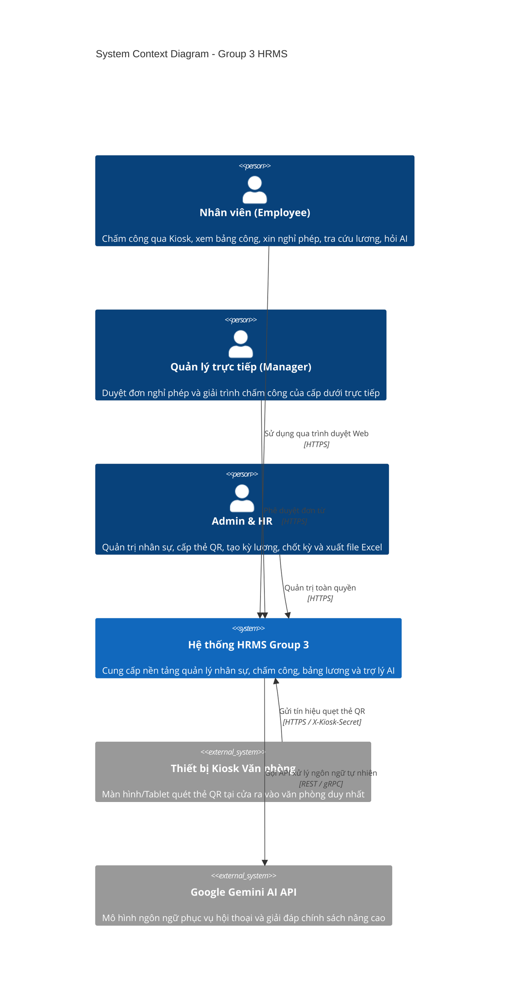
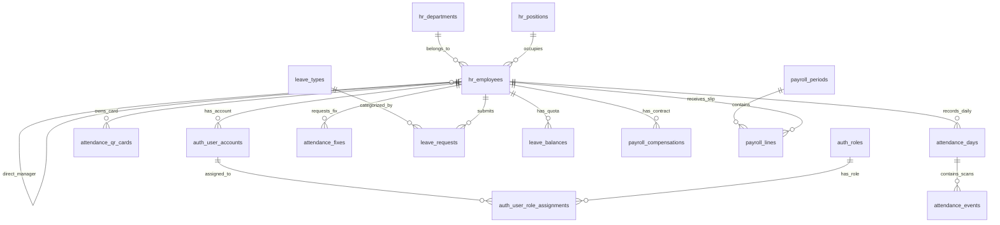

# SOFTWARE ARCHITECTURE DOCUMENT (SAD)
## HỆ THỐNG QUẢN LÝ NHÂN SỰ & CHẤM CÔNG THÔNG MINH (GROUP 3 HRMS)

---

### 1. Giới thiệu tổng quan (Introduction)

#### 1.1. Mục đích tài liệu
Tài liệu Kiến trúc Phần mềm (Software Architecture Document - SAD) cung cấp cái nhìn toàn diện, chuẩn hóa theo các tiêu chuẩn công nghiệp (dựa trên mô hình C4 và tiêu chuẩn ISO/IEC/IEEE 42010) về hệ thống **HR Management with AI System** (Group 3). Tài liệu đóng vai trò kim chỉ nam cho các kỹ sư phần mềm, kiến trúc sư hệ thống, và các bên liên quan trong việc phát triển, vận hành và mở rộng dự án.

#### 1.2. Phạm vi hệ thống (System Scope)
Hệ thống giải quyết trọn vẹn nghiệp vụ quản trị nhân sự nội bộ:
* **Tổ chức & Nhân sự:** Quản lý cơ cấu phòng ban, chức danh, hồ sơ nhân viên và quan hệ quản lý phân cấp trực tiếp (`manager_employee_id`).
* **Chấm công Kiosk & Thẻ QR tĩnh:** 1 văn phòng làm việc duy nhất, chuẩn 8 tiếng/ngày (08:00 - 17:00, nghỉ trưa 12:00 - 13:00 không tính giờ làm), cơ chế chống quét lặp (idempotency).
* **Giải trình chấm công:** Nhân viên giải trình quên quét thẻ; **Quản lý trực tiếp phê duyệt** trước ngày chốt công cuối tháng.
* **Nghỉ phép đa dạng:** Đăng ký theo buổi (Sáng 0.5 công, Chiều 0.5 công, Cả ngày 1.0 công); quản lý hạn mức phép năm, **tự động hết hạn vào 31/12**, cơ chế chuyển sang nghỉ không lương.
* **Bảng lương & Thuế TNCN Việt Nam:** Tính toán tự động theo lương Gross, trích đóng bảo hiểm 10.5% (BHXH 8%, BHYT 1.5%, BHTN 1%), giảm trừ bản thân 11M, thuế lũy tiến từng phần, xuất báo cáo Excel (`.xlsx`), cơ chế khóa kỳ lương cố định dữ liệu.
* **Trợ lý AI nội bộ:** RAG trả lời chính sách, tra cứu dữ liệu cá nhân theo ngữ cảnh thực, hỗ trợ Function Calling tạo nháp đơn nghỉ phép và giải trình.

---

### 2. Nguyên tắc & Ràng buộc kiến trúc (Architectural Drivers & Constraints)

1. **Clean Architecture & Separation of Concerns (SoC):** Tách biệt rõ ràng 4 tầng: Tầng Trình diễn (Presentation/Frontend), Tầng Giao tiếp (API Gateway/Routing), Tầng Nghiệp vụ (Domain Services), và Tầng Dữ liệu (ORM/Database).
2. **Stateless Backend:** Backend FastAPI hoàn toàn không lưu trạng thái phiên (session state) trên bộ nhớ RAM, xác thực hoàn toàn qua JWT (JSON Web Tokens).
3. **Async I/O non-blocking:** Tận dụng tối đa `asyncio` và `asyncpg` để phục vụ hàng ngàn kết nối đồng thời với mức tiêu hao tài nguyên thấp.
4. **Idempotency & Data Integrity:** Đảm bảo mọi thao tác quẹt thẻ, tính lương, và duyệt đơn đều có tính lũy đẳng, chống ghi trùng lặp và bảo toàn tính nhất quán dữ liệu ACID.
5. **AI Fault-Tolerance (Non-blocking AI Calls):** Gọi LLM ngoài (Google Gemini) qua luồng worker riêng biệt (`asyncio.to_thread`) với cơ chế ngắt thời gian chờ (timeout 5s) và bộ dự phòng luật cục bộ (rule-based fallback), đảm bảo server không bao giờ bị nghẽn Event Loop.

---

### 3. Kiến trúc C4 Model

#### 3.1. C4 - Level 1: Ngữ cảnh hệ thống (System Context Diagram)



---

#### 3.2. C4 - Level 2: Kiến trúc Container (Container Diagram)

```mermaid
graph TD
    subgraph Client Layer
        WebSPA["Frontend Web App<br/>(React 19 + TypeScript + Vite + Ant Design)"]
        KioskWeb["Màn hình Kiosk Chấm công<br/>(React Web / Fullscreen View)"]
    end

    subgraph Server Layer (FastAPI Backend)
        APIRouter["API Gateway & Routers<br/>(/api/v1/*)"]
        AuthMiddleware["Security & Auth Middleware<br/>(JWT Bearer + RBAC)"]
        KioskAuth["Kiosk Secret Validator<br/>(Header: X-Kiosk-Secret)"]
        
        subgraph Domain Services
            AttService["Attendance Service"]
            LeaveService["Leave Service"]
            PayrollService["Payroll & Tax Service"]
            AIService["HR AI Assistant Service"]
        end
    end

    subgraph Data & Storage Layer
        PostgresDB[("PostgreSQL 16 Database<br/>(SQLAlchemy 2.x + Asyncpg)")]
        ExcelStorage["Excel Exporter<br/>(openpyxl memory streaming)"]
    end

    subgraph External Services
        GeminiLLM["Google Gemini AI"]
    end

    WebSPA -->|JSON / REST| APIRouter
    KioskWeb -->|JSON / POST| APIRouter

    APIRouter --> AuthMiddleware
    APIRouter --> KioskAuth

    AuthMiddleware --> AttService
    AuthMiddleware --> LeaveService
    AuthMiddleware --> PayrollService
    AuthMiddleware --> AIService

    KioskAuth --> AttService

    AttService --> PostgresDB
    LeaveService --> PostgresDB
    PayrollService --> PostgresDB
    PayrollService --> ExcelStorage
    AIService --> PostgresDB
    AIService -.->|Non-blocking Timeout 5s| GeminiLLM
```

---

### 4. Thiết kế chi tiết các tầng (Layered Architecture)

#### 4.1. Tầng Trình diễn (Presentation Layer - Frontend)
* **Công nghệ:** React 19, TypeScript, Vite, Ant Design v5, React Router DOM v7, Axios, Day.js, Canvas Confetti.
* **Mô hình State & Context:** `AuthContext` quản lý người dùng phiên làm việc, phân quyền dựa trên mảng `roles` (`ADMIN`, `HR`, `MANAGER`, `EMPLOYEE`).
* **Routing & Bảo vệ tuyến đường (`ProtectedRoute`):**
  * `/login`: Xác thực và hỗ trợ đăng nhập 1-click cho tài khoản kiểm thử.
  * `/dashboard`: Trung tâm điều khiển, thống kê công, số dư phép, thông báo và lối tắt.
  * `/attendance`: Bảng công cá nhân, nộp giải trình và tab duyệt của Quản lý.
  * `/leaves`: Quản lý hạn mức phép năm, nộp đơn xin nghỉ theo buổi (Sáng/Chiều/Cả ngày) và tab duyệt của Quản lý.
  * `/payroll`: Dành cho HR/Admin (tính lương, khóa kỳ, xuất Excel) và Nhân viên (tra cứu phiếu lương cá nhân).
  * `/kiosk`: Màn hình chuyên dụng tại cửa văn phòng, đồng hồ thời gian thực và mô phỏng quẹt thẻ kèm âm thanh & pháo hoa.
  * `/employees`: Quản lý danh sách nhân sự và tạo mã QR thẻ chấm công.
* **Component Trợ lý AI (`AIChatModal`):** Nút tròn nổi tại góc phải, hỗ trợ Markdown, câu hỏi mẫu nhanh và thẻ hành động trực tiếp (Quick Action Cards).

#### 4.2. Tầng Dịch vụ Backend (Application & Domain Services Layer)

##### a. Attendance Service (`attendance_service.py`)
* **Quy chuẩn tính công:**
  * Giờ làm việc: 08:00 - 17:00 (chuẩn 8 tiếng/ngày).
  * Nghỉ trưa: 12:00 - 13:00 (1 tiếng) **tuyệt đối không được tính vào số giờ làm**.
  * Công thức tính số phút làm việc thực tế:
    $$\text{Worked Minutes} = (\min(\text{checkout}, 17:00) - \max(\text{checkin}, 08:00)) - \text{Lunch Duration}$$
* **Cơ chế chống quét lặp (Scan Idempotency):**
  Nếu một thẻ quét 2 lần liên tiếp trong khoảng cách dưới 60 giây, hệ thống trả về bản ghi sự kiện trước đó kèm cảnh báo mà không tạo thêm dữ liệu thừa.
* **Giải trình chấm công & Khóa kỳ:**
  Khi kỳ lương tháng đã bị đóng (`PayrollPeriod.status == 'CLOSED'`), hệ thống từ chối mọi yêu cầu giải trình hoặc duyệt công của kỳ đó để bảo vệ số liệu kế toán.

##### b. Leave Service (`leave_service.py`)
* **Đăng ký theo buổi (Session):**
  * `MORNING`: 08:00 - 12:00 (4 tiếng / 0.5 ngày công).
  * `AFTERNOON`: 13:00 - 17:00 (4 tiếng / 0.5 ngày công).
  * `FULL_DAY`: 08:00 - 17:00 (8 tiếng / 1.0 ngày công).
* **Hạn mức & Hết hạn phép năm:**
  * Hạn mức phép năm (`LeaveBalance.total_entitled_days`): Tiêu chuẩn 12 ngày/năm.
  * Quy tắc hết hạn: Toàn bộ phép tồn **tự động hết hạn vào ngày 31/12**, không được cộng dồn hay chuyển sang năm tiếp theo.
  * Ràng buộc: Khi `remaining_days < số ngày xin nghỉ`, hệ thống buộc người dùng chọn loại nghỉ không hưởng lương (`UNPAID_LEAVE`).
* **Phân quyền duyệt:** Chỉ **Quản lý trực tiếp** (`manager_employee_id`) của nhân viên mới có quyền duyệt đơn, không cần HR duyệt.

##### c. Payroll Service (`payroll_service.py`)
* **Quy chuẩn trích đóng bảo hiểm (Luật Lao động Việt Nam):**
  * BHXH: $8\%$
  * BHYT: $1.5\%$
  * BHTN: $1\%$
  * **Tổng trích đóng:** $10.5\%$ tính trên mức lương Gross đóng bảo hiểm.
* **Thuế Thu nhập cá nhân (TNCN):**
  * Giảm trừ gia cảnh bản thân: $11.000.000$ VNĐ/tháng.
  * Thu nhập tính thuế = Lương Gross thực tế - Các khoản bảo hiểm - Giảm trừ gia cảnh.
  * Biểu thuế lũy tiến từng phần theo Thông tư 111/2013/TT-BTC:
    * Bậc 1 (Đến 5 triệu): $5\%$
    * Bậc 2 (Trên 5 đến 10 triệu): $10\% - 250.000$
    * Bậc 3 (Trên 10 đến 18 triệu): $15\% - 750.000$
    * Bậc 4 (Trên 18 đến 32 triệu): $20\% - 1.650.000$
    * Bậc 5 (Trên 32 đến 52 triệu): $25\% - 3.250.000$
    * Bậc 6 (Trên 52 đến 80 triệu): $30\% - 5.850.000$
    * Bậc 7 (Trên 80 triệu): $35\% - 9.850.000$
* **Báo cáo Excel:** Sử dụng thư viện `openpyxl` tạo bảng tính định dạng chuẩn kế toán (tiêu đề, kẻ bảng, in đậm, căn lề, định dạng tiền tệ Việt Nam VNĐ) và truyền trực tiếp qua luồng bộ nhớ `StreamingResponse`.

##### d. AI Assistant Service (`ai_service.py`)
* **Kiến trúc Hybrid (RAG + Rule Engine + Non-blocking Fallback):**
  1. *Phát hiện ý định (Intent Detection):* Bóc tách câu hỏi tra cứu phép, ngày công, hoặc soạn nháp đơn bằng Regex/Pattern matching.
  2. *Truy xuất dữ liệu ngữ cảnh (Context Injection):* Nạp số dư phép thực tế, các ngày thiếu công trong tháng của chính nhân viên đang đăng nhập.
  3. *Tương tác Gemini LLM an toàn:*
     ```python
     response = await asyncio.wait_for(
         asyncio.to_thread(_call_gemini_blocking),
         timeout=5.0
     )
     ```
     Nếu không có internet, API key sai hoặc phản hồi chậm quá 5s, hệ thống lập tức kích hoạt bộ chính sách dự phòng nội bộ, đảm bảo tính liên tục 100%.

---

### 5. Kiến trúc Dữ liệu & Cơ sở dữ liệu (Database Schema)

Cơ sở dữ liệu gồm 14 bảng quan hệ được chuẩn hóa theo chuẩn 3NF:



---

### 6. Kiến trúc Bảo mật (Security Architecture)

1. **Mã hóa Mật khẩu:** Sử dụng thuật toán `bcrypt` trực tiếp (với Salt 12 rounds) đảm bảo tiêu chuẩn chống tấn công Brute-force & Rainbow Table.
2. **Xác thực API (JWT Authentication):**
   * `access_token`: Thời hạn 8 tiếng (phù hợp 1 ca làm việc), mang theo Subject ID và Role Claim.
   * `refresh_token`: Thời hạn 7 ngày, dùng để cấp phát lại Access Token mà không cần đăng nhập lại.
3. **Phân quyền theo vai trò (Role-Based Access Control - RBAC):**
   * Dependency injection `require_roles(["ADMIN", "HR"])` kiểm soát truy cập tại từng endpoint.
4. **Bảo mật Kiosk Web:**
   * Máy Kiosk sử dụng Header chuyên dụng `X-Kiosk-Secret` do ban quản trị thiết lập trong biến môi trường `KIOSK_API_SECRET_KEY`.
5. **CORS Whitelist:** Chỉ cho phép các domain được khai báo trong `CORS_ORIGINS` kết nối đến Backend.

---

### 7. Thuộc tính phi chức năng (Non-Functional Requirements - NFR)

| Tiêu chuẩn | Cam kết thiết kế | Giải pháp kỹ thuật |
| :--- | :--- | :--- |
| **Hiệu năng (Performance)** | Thời gian phản hồi API < 100ms | Asyncpg connection pool (10-30 connections), chỉ mục Index trên `work_date`, `employee_id`, `status`. |
| **Khả năng mở rộng (Scalability)** | Stateless Server, có thể scale ngang | Tách biệt hoàn toàn Stateless FastAPI container và Stateful PostgreSQL container. |
| **Độ tin cậy (Reliability)** | Uptime 99.9% | Healthcheck endpoints, Docker auto-restart, Non-blocking AI fallback. |
| **Khả năng bảo trì (Maintainability)**| Tuân thủ PEP 8, Clean Code | Pydantic v2 type hints, Alembic database migration versioning, Unit & Integration Test suite. |
| **Bảo mật dữ liệu (Data Privacy)** | Phân quyền truy cập đa cấp | Mỗi nhân viên chỉ xem được dữ liệu chấm công và phiếu lương của chính mình. |
