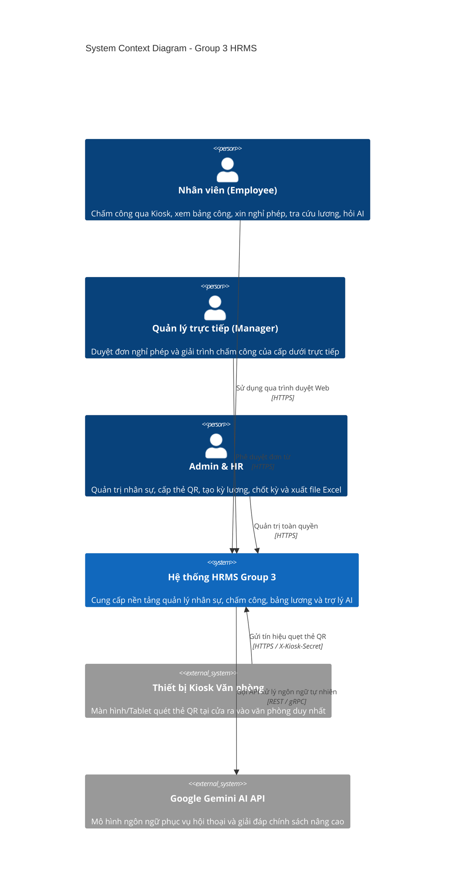
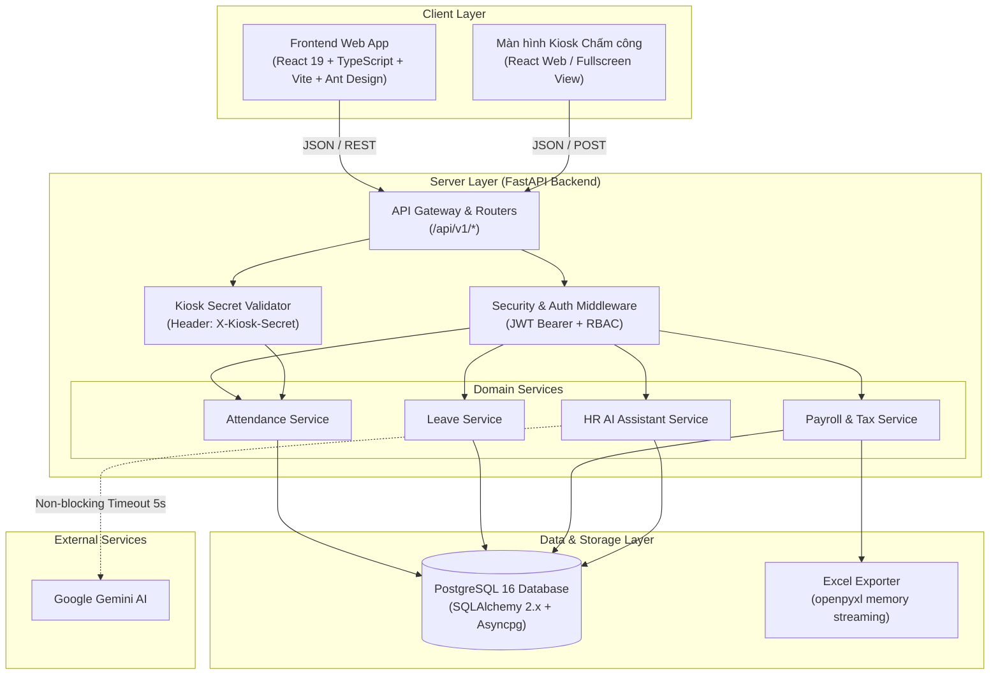
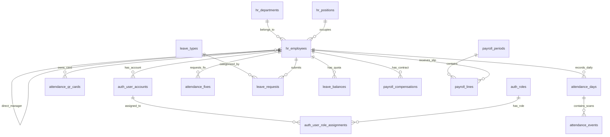
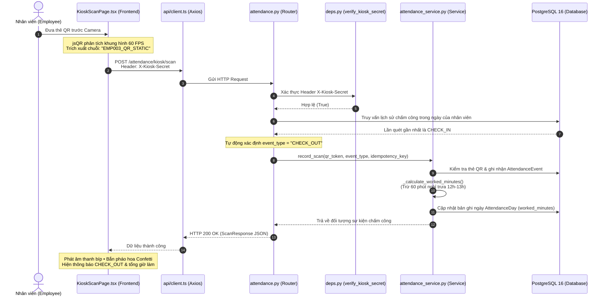

# SOFTWARE ARCHITECTURE DOCUMENT (SAD)

Parser nháp xử lý lượt thu thập reason trước bộ nhận dạng ngày/buổi/giờ; phần lý do được tách khỏi nội dung yêu cầu khi nhập gộp. Validator PDF duyệt toàn bộ đồ thị dictionary/array và giải tham chiếu gián tiếp bằng stack, dùng tập object đã thăm để chống vòng lặp và tránh giới hạn đệ quy. Kiểm tra bao gồm AcroForm/Fields, XFA, Outlines và chuỗi action; không giải mã stream để tìm từ khóa.

Provider Gemini là opt-in qua `GEMINI_ENABLED` (mặc định false). Hai nhánh gọi provider giới hạn đầu ra 128/384 token, câu hỏi đã redaction tối đa 600 ký tự, tổng nguồn tối đa 4.000 ký tự; SDK đặt `retry=None`, timeout 5 giây. Không gọi provider cho fallback chuẩn. Đây là giới hạn mỗi lần gọi, chưa phải hạn mức token mỗi ngày.

## HỆ THỐNG QUẢN LÝ NHÂN SỰ & CHẤM CÔNG THÔNG MINH (GROUP 3 HRMS)

Scope creation được resolve tường minh: mặc định SELF, ngoại lệ HEADCOUNT/approval/payroll summary theo capability. Scope SELF/DIRECT_REPORTS cần employee linkage; approval queue từ chối scope khác thay vì âm thầm đổi. Failed run không bị preview làm mất trạng thái. Leave draft lookup quota theo leave_date.year. [Acceptance matrix](AI_ACCEPTANCE.md) phân biệt unit/static, UI fixture và DB evidence; browser harness thực dùng local worker và API fixture, chưa chứng minh DB authorization.

Types frontend AI/report được dùng chung; discriminated action union thay data Any ở chat. Resolver suggestion_report_defaults cung cấp default_inputs và tham số khởi tạo cùng nguồn; input người dùng chỉ ghi trường cho phép, catalog kiểm scope/kind trước DB. UI fallback gợi ý dùng actor capabilities, không cấp quyền. Lỗi blob đọc JSON envelope có giới hạn 64 KiB; redirect 401 giữ SESSION_EXPIRED trên login, kiosk vẫn không bị redirect.

PayrollLine.currency_code là snapshot nullable với constraint ba chữ cái uppercase; calculation lưu active_comp.currency_code, report không đọc lại compensation để suy ra tiền tệ. Migration d9e0f1a2b3c4 không backfill giả cho legacy. MY_PAYSLIP/PAYROLL_SUMMARY từ chối mã thiếu/sai, nhóm theo department/currency và Excel summary tách tiền tệ. Không đổi công thức tính, tax hay kỳ phát hành APPROVED/CLOSED; tính lương phi VND chưa được nghiệm thu. DB upgrade/legacy verification còn thiếu.

Suggestion reference được ánh xạ theo thao tác tới LEAVE.REQUEST/REPORT.CATALOG/REPORT.ACCESS, kiểm lại PUBLISHED, effective, answerable và minimum_role của cả document/version. Server thêm nhãn tham khảo vào prompt, dispatch dùng suggestion_id để tránh diễn giải nhãn. PDF demo có internal bookmarks và mục lục không lặp nguyên heading để viewer highlight đúng heading nội dung. Generator kiểm số trang/bookmark/heading bằng pypdf trước ghi manifest hash và tạo bản Markdown đồng bộ; upload/seed dùng parser bảo mật. Report expiry chỉ trả 410 sau khi lookup owner; UUID không thuộc owner vẫn 404.

Cleanup CLI đọc storage references của mọi owner/state, chỉ xét artifacts theo regex UUID server, không symlink và mtime quá hai giờ (lớn hơn TTL một giờ và deadline tạo). Orphan scan không xóa; --apply mới xóa rồi dọn metadata quá 30 ngày đã hết hạn, không còn keys. Không quét root ngoài REPORT_STORAGE_DIR. Nếu DB không đọc được references thì không dọn orphan. Trạng thái FAILED được giữ trong cửa sổ lịch sử; job chưa chạy với DB thực.

`core/ai_errors.py` cài middleware và exception handlers cho đường dẫn AI/reports. Mỗi request có UUID server, chia sẻ qua ContextVar với audit, trả trong header/body; không tin X-Request-ID đầu vào. Catalog chuẩn hóa lỗi xác thực/quyền/nháp/provider/dữ liệu, giữ status và legacy detail có mã giới hạn. Validation không echo request body; exception không trả nội dung DB/đường dẫn. Ngoài namespace này giữ HTTP/validation handler mặc định. Responses lỗi private/no-store, action null, sources rỗng; UI ưu tiên message của backend và xóa action cũ khi bắt đầu lượt mới. Chat schema yêu cầu revision khi tiếp tục nháp, nhận operation cấu trúc không cần text giả.

`AIReportDraftService` dùng cùng bảng nháp và row lock của `AIDraftService`, command DRAFT_REPORT chỉ nhận kind/start_date/end_date/scope/department_id. Danh tính, danh sách employee và đường dẫn template không phải input. Catalog tạo các lựa chọn kind/scope theo actor; quyền được kiểm trước tạo/cập nhật nháp và lại tại ReportRunService. Khi đủ trường, ReportRunCreate kiểm kỳ rồi service tạo snapshot thật; nháp chuyển READY. Phân loại Gemini chỉ chọn kind từ enum, còn kỳ/phạm vi do parser/input có kiểu thu thập. UI nhận `input_options` có field/value/label, không coi nút lựa chọn là cấp quyền. Không cần migration mới; nghiệm thu DB nhiều lượt còn thiếu.

Dispatch giữ nhận diện câu hỏi chính sách từ registry sau khi canonicalize prompt; nguồn không còn answerable/effective/readable trả KNOWLEDGE_NOT_FOUND trước intent classifier. Ba prompt chính sách nhập nguyên văn cũng dùng cùng fallback. Kiểm tra employee linkage áp dụng cho thao tác dữ liệu cá nhân, còn đọc chính sách kiểm quyền tài liệu.

`ReportRunService` ghi lifecycle bằng session riêng để rollback truy vấn nghiệp vụ không xóa trạng thái thất bại. Chốt danh sách employee IDs trước truy vấn rồi giao với scope được xác thực trong từng SQL; không mở rộng snapshot khi quan hệ nhân sự thay đổi. Chỉ ghi READY sau khi cả hai artifacts được lưu; lỗi giữ mã an toàn trong FAILED và dọn file đã tạo. Khi DB mất kết nối, có thể không lưu được FAILED; API vẫn trả lỗi, không trả READY. Cleanup giữ FAILED, chuyển READY/GENERATING quá hạn thành EXPIRED; metadata lịch sử chỉ hiển thị trong 30 ngày. Cleanup CLI mặc định dry-run, xóa khi có `--apply`. Không cần migration mới cho lifecycle này; DB concurrency chưa được xác minh.

**Trạng thái AI hiện tại:** JWT xác định actor/role/owner; history không nhận role system. Draft owner/revision/TTL/row lock và typed validation chỉ tạo dữ liệu trong form. Gemini phân loại enum sau fallback, nhận input đã giảm PII, không nhận history/DB rows; quotes phải nguyên văn trong section PUBLISHED/effective/answerable được cấp quyền. PDF private có version/section/publish/archive và viewer xác thực. `ReportService` lọc scope trước aggregation, `ReportRunService` lưu snapshot/XLSX private một giờ và kiểm lại owner/scope lúc xem/tải. Có bảy loại report, bảy file template v1 cố định, giới hạn 10.000 dòng và bảo toàn Decimal lớn bằng text chính xác. MY_PAYSLIP chỉ SELF; PAYROLL_SUMMARY chỉ HR/ADMIN, nhóm phòng ban hiện tại; chỉ kỳ APPROVED/CLOSED, không tính lại lương. PayrollLine lưu mã tiền tệ từ hồ sơ nguồn khi tính; report tách tổng theo currency snapshot, dòng legacy chưa xác minh bị từ chối. Responses `private, no-store`; UI preview/download trong chat và cleanup đã có. SQLAlchemy ẩn tham số log. Migration/seed và browser flows chưa có bằng chứng tích hợp. Xem [AI Copilot](AI_COPILOT.md).

Migration `b7c8d9e0f1a2` thêm `hr_ai_knowledge_document_versions`, `hr_ai_knowledge_sections`, `hr_ai_chat_drafts` và `hr_report_runs`. Cột legacy được giữ; mỗi tài liệu cũ được backfill thành version `LEGACY_TEXT` với page null, section không có PDF thì không tự nhận citation PDF. Draft và report run lưu owner, expiry; run giữ scope snapshot và storage key private. Migration mới chỉ render offline; chưa xác minh upgrade trên DB test.

`ReportRunService` là đường tạo snapshot/XLSX chung cho chat fallback và API báo cáo. Action `OPEN_REPORT` có `run_id` khi file đã tạo thành công; ChatReportPreview fetch lại run bằng JWT để hiển thị đúng snapshot. Nháp đầy đủ ngay từ đầu cũng đi qua cùng state machine và validation như nháp nhiều lượt, không làm mất lý do. Client gửi `draft_revision`; revision cũ trả 409. Tài liệu trả fallback trước, chỉ gọi provider để xử lý yêu cầu tóm tắt/giải thích/so sánh có nguồn, JSON quotes dùng schema đóng.

Migration `c8d9e0f1a2b3` thêm `hr_ai_request_events`. `secured_operation` ghi audit thành công/từ chối/lỗi, dùng request ID chung cho chat và report con. Budget được commit độc lập trước truy vấn nghiệp vụ; PostgreSQL transaction advisory lock theo actor/channel serialize các process, đếm cửa sổ 60 giây (20 CHAT, 5 REPORT). Audit chỉ nhận enum và command token, không lưu nội dung người dùng. Kho audit/budget lỗi thì fail closed với `DATA_SERVICE_UNAVAILABLE`. Query budget dùng statement timeout 10 giây/lock timeout 5 giây; luồng chat và truy vấn ReportRun có deadline 30 giây. Retention 90 ngày bằng script dry-run/`--apply`. Chưa xác minh cơ chế nhiều process trên DB test. Phát hành phiếu lương/tổng hợp chỉ ở APPROVED hoặc CLOSED theo quyết định D01.

Bảy templates đọc bằng kind cố định từ `backend/app/report_templates`, không dùng path do client/model gửi. Money giữ Decimal trong query/aggregation; Excel dùng text chính xác khi quá 15 chữ số. PayrollLine có currency snapshot; không suy đoán mã cho dòng legacy chưa lưu. Tổng Excel tách theo currency. Static migration SQL đã render tới `c8d9e0f1a2b3`; 63 tests dùng mock đạt và frontend build đạt. Migration/seed, SQL scope thực thi, multi-process budget và browser flows còn phải kiểm chứng trên môi trường test.

`ai_suggestions.py` là registry dùng chung cho list và dispatch: ID resolve prompt chuẩn, role và điều kiện có employee được kiểm lại trước handler. Inputs draft có schema key/value theo command; action wire shape cũ có validator theo discriminator, khóa route, period, ID, enum và extra keys. Chat trả status/missing_fields/message_code/request_id để UI chọn field/hủy draft; audit và response dùng chung request ID. Lý do khám bệnh không suy ra SICK. Nội quy không có nguồn trả KNOWLEDGE_NOT_FOUND; chat trái quyền dùng HTTP 403.

`report_catalog.py` đọc cột từ bảy template được cố định theo kind, cache riêng metadata template và lọc capabilities của actor ở mỗi request; không cache quyền theo user. Catalog có scopes/filter/period_rule/default_scope; UI lấy danh sách loại/phạm vi ở server. History giữ cửa sổ hiển thị 30 ngày, keyset cursor theo `(created_at, run_id)` giảm dần; cursor được validate và không thay owner predicate. Cleanup khi mở lịch sử chỉ xử lý run của owner, script định kỳ xử lý toàn bộ. Preview phân trang trên snapshot đã được authorize đầy đủ; cả page và file đều kiểm current scope. Catalog/history/preview dùng private/no-store, file có alias `/file`. Report draft truyền initial filters vào interpreter và parser để chọn kỳ theo kind. Preview được remount theo run_id, reset phân trang và dữ liệu khi đổi snapshot.

Knowledge DRAFT editor khóa document rồi version, kiểm cả minimum_role hiện tại, chỉ sửa trạng thái DRAFT. Metadata và sections có thể lưu trong một transaction; section content do parser lấy từ PDF, client chỉ cung cấp heading/trang/answerable. Validate hash/page/heading trước khi thay mapping; PUBLISHED giữ section IDs và nội dung bất biến. Preview query chỉ dành cho HR/ADMIN, kiểm document/version, vẫn chặn ARCHIVED; list version và source SQL lọc minimum_role từng bản. File đọc lại SHA-256 trước phục vụ. Những mục is_answerable=false chỉ xuất hiện trong preview quản trị, không vào public citation/RAG.

Upload `/ai/knowledge/{document_id}/versions` kiểm tra PDF thật bằng pypdf (10 MiB/100 trang, không mã hóa, active action, link ngoài hay embedded files), trích text server-side và yêu cầu mapping heading/page khớp. File dùng UUID `.pdf` dưới `backend/storage/private/ai-knowledge`, ghi staging rồi rename; storage key không trả cho client và không mount static. File/section API kiểm tra JWT, document/version/section status và cả hai mức quyền; response `private, no-store`. Frontend lấy bytes bằng API client có Bearer JWT và render bằng PDF.js worker đã bundle local; viewer tô sáng heading khớp text item. Chưa có kiểm tra browser thực tế hoặc DB migration trên test DB.

`GET /api/v1/ai/suggestions` tạo gợi ý dựa trên role của user đã xác thực. Gợi ý nội quy chỉ được thêm nếu truy vấn tìm thấy section answerable thuộc document/version đã publish, trong effective date và trong quyền đọc; viewer URL được tạo từ khóa section phía server. Gợi ý role-based chỉ là UI affordance, còn từng lệnh/endpoint vẫn kiểm tra capability. Process chat xác định intent trước khi tải context cá nhân; chỉ các handler tra cứu/soạn đơn hợp lệ mới truy vấn dữ liệu công/phép của chính user. Các shortcut dùng enum allowlist: report điền loại và kỳ hiện tại, approvals mở tab PENDING, knowledge mở màn quản trị. Không có thao tác gửi/duyệt từ chat. Network, permission và provider errors dùng message catalog chung.

Reports hỗ trợ bảy kind qua `GET /api/v1/reports` và `POST /api/v1/reports/runs`. Tạo run ghi preview JSON và XLSX vào `REPORT_STORAGE_DIR` dưới khóa UUID, lưu owner/scope/filter/template version/employee ID snapshot/expiry trong `hr_report_runs`. Preview và download yêu cầu JWT của owner, kỳ còn hạn, hash XLSX hợp lệ và kiểm tra lại quyền hiện thời; ID ngoài scope không được trả về client. TTL một giờ; list history dọn artifacts hết hạn khi chạy, script `backend/scripts/cleanup_expired_report_runs.py --apply` có thể được lập lịch để dọn cả khi không có request và cập nhật trạng thái. Workbook có ba sheet; chỉ số dùng kiểu số, trường text chống formula injection. Không mount report storage static.

Ba tài liệu PDF ví dụ và `manifest.json` được tạo vào `backend/storage/tmp/ai-knowledge-demo` bằng `backend/scripts/generate_demo_knowledge.py`. Chúng là bản nháp chưa được phê duyệt; nguồn pháp luật được dẫn riêng trong tài liệu nghỉ phép, còn quy trình nội bộ được ghi là đề xuất. `backend/scripts/seed_demo_knowledge.py` chỉ chạy khi `ENVIRONMENT` là development/test và cần cờ xác nhận cùng ID tài khoản active; seed tạo document/version/section ở DRAFT, chuyển PDF vào storage private, không publish và không ghi đè document đã có nội dung khác.

Danh sách leave/fix có `view=mine|approvals|visible`. `approvals` join employee với `manager_employee_id` hiện tại và chỉ lấy trạng thái PENDING; không dựa vào `reviewer_employee_id`. Dịch vụ duyệt khóa hàng employee bằng `FOR UPDATE`, kiểm tra lại quan hệ trực tiếp trước mutation và commit, từ chối tự duyệt, không có ADMIN bypass. HR được duyệt khi là quản lý trực tiếp.

---

### 1. Giới thiệu tổng quan (Introduction)

#### 1.1. Mục đích tài liệu
Tài liệu Kiến trúc Phần mềm (Software Architecture Document - SAD) cung cấp cái nhìn toàn diện, chuẩn hóa theo các tiêu chuẩn công nghiệp (dựa trên mô hình C4 và tiêu chuẩn ISO/IEC/IEEE 42010) về hệ thống **HR Management with AI System** (Group 3). Tài liệu đóng vai trò kim chỉ nam cho các kỹ sư phần mềm, kiến trúc sư hệ thống, và các bên liên quan trong việc phát triển, vận hành và mở rộng dự án.

#### 1.2. Phạm vi hệ thống (System Scope)
Hệ thống giải quyết trọn vẹn nghiệp vụ quản trị nhân sự nội bộ:
* **Tổ chức & Nhân sự:** Quản lý cơ cấu phòng ban, chức danh, hồ sơ nhân viên và quan hệ quản lý phân cấp trực tiếp (`manager_employee_id`).
* **Chấm công Kiosk & Thẻ QR tĩnh:** 1 văn phòng làm việc duy nhất, chuẩn 8 tiếng/ngày (08:00 - 17:00, nghỉ trưa 12:00 - 13:00 không tính giờ làm), cơ chế chống quét lặp (idempotency).
* **Giải trình chấm công:** Nhân viên giải trình quên quét thẻ; **Quản lý trực tiếp phê duyệt** trước ngày chốt công cuối tháng.
* **Nghỉ phép đa dạng:** Đăng ký theo buổi (Sáng 0.5 công, Chiều 0.5 công, Cả ngày 1.0 công); quản lý hạn mức phép năm, **tự động hết hạn vào 31/12**, cơ chế chuyển sang nghỉ không lương.
* **Bảng lương & Thuế TNCN Việt Nam:** Tính toán tự động theo lương Gross, trích đóng bảo hiểm 10.5% (BHXH 8%, BHYT 1.5%, BHTN 1%), giảm trừ bản thân 11M, thuế lũy tiến từng phần, xuất báo cáo Excel (`.xlsx`), cơ chế khóa kỳ lương cố định dữ liệu.
* **Trợ lý AI nội bộ:** RAG trả lời chính sách, tra cứu dữ liệu cá nhân theo ngữ cảnh thực, hỗ trợ Function Calling tạo nháp đơn nghỉ phép và giải trình.

---

### 2. Nguyên tắc & Ràng buộc kiến trúc (Architectural Drivers & Constraints)

1. **Clean Architecture & Separation of Concerns (SoC):** Tách biệt rõ ràng 4 tầng: Tầng Trình diễn (Presentation/Frontend), Tầng Giao tiếp (API Gateway/Routing), Tầng Nghiệp vụ (Domain Services), và Tầng Dữ liệu (ORM/Database).
2. **Stateless Backend:** Backend FastAPI hoàn toàn không lưu trạng thái phiên (session state) trên bộ nhớ RAM, xác thực hoàn toàn qua JWT (JSON Web Tokens).
3. **Async I/O non-blocking:** Tận dụng tối đa `asyncio` và `asyncpg` để phục vụ hàng ngàn kết nối đồng thời với mức tiêu hao tài nguyên thấp.
4. **Idempotency & Data Integrity:** Đảm bảo mọi thao tác quẹt thẻ, tính lương, và duyệt đơn đều có tính lũy đẳng, chống ghi trùng lặp và bảo toàn tính nhất quán dữ liệu ACID.
5. **AI Fault-Tolerance:** Gọi Gemini qua `generate_content_async` với timeout 5 giây; handler xác định và trích nguồn có sẵn được ưu tiên. Nếu không có fallback cho câu hỏi HR tự do và provider lỗi, trả `AI_UNAVAILABLE`.

---

### 3. Kiến trúc C4 Model

#### 3.1. C4 - Level 1: Ngữ cảnh hệ thống (System Context Diagram)



---

#### 3.2. C4 - Level 2: Kiến trúc Container (Container Diagram)



---

### 4. Thiết kế chi tiết các tầng (Layered Architecture)

#### 4.1. Tầng Trình diễn (Presentation Layer - Frontend)
* **Công nghệ:** React 19, TypeScript, Vite, Ant Design v5, React Router DOM v7, Axios, Day.js, Canvas Confetti.
* **Mô hình State & Context:** `AuthContext` quản lý người dùng phiên làm việc, phân quyền dựa trên mảng `roles` (`ADMIN`, `HR`, `MANAGER`, `EMPLOYEE`).
* **Routing & Bảo vệ tuyến đường (`ProtectedRoute`):**
  * `/login`: Xác thực và hỗ trợ đăng nhập 1-click cho tài khoản kiểm thử.
  * `/dashboard`: Trung tâm điều khiển, thống kê công, số dư phép, thông báo và lối tắt.
  * `/attendance`: Bảng công cá nhân, nộp giải trình và tab duyệt của Quản lý.
  * `/leaves`: Quản lý hạn mức phép năm, nộp đơn xin nghỉ theo buổi (Sáng/Chiều/Cả ngày) và tab duyệt của Quản lý.
  * `/payroll`: Dành cho HR/Admin (tính lương, khóa kỳ, xuất Excel) và Nhân viên (tra cứu phiếu lương cá nhân).
  * `/kiosk`: Màn hình chuyên dụng tại cửa văn phòng, đồng hồ thời gian thực và mô phỏng quẹt thẻ kèm âm thanh & pháo hoa.
  * `/employees`: Quản lý danh sách nhân sự và tạo mã QR thẻ chấm công.
* **Component Trợ lý AI (`AIChatModal`):** Nút tròn nổi tại góc phải, hỗ trợ Markdown, câu hỏi mẫu nhanh và thẻ hành động trực tiếp (Quick Action Cards).

#### 4.2. Tầng Dịch vụ Backend (Application & Domain Services Layer)

##### a. Attendance Service (`attendance_service.py`)
* **Quy chuẩn tính công:**
  * Giờ làm việc: 08:00 - 17:00 (chuẩn 8 tiếng/ngày).
  * Nghỉ trưa: 12:00 - 13:00 (1 tiếng) **tuyệt đối không được tính vào số giờ làm**.
  * Công thức tính số phút làm việc thực tế:
    $$\text{Worked Minutes} = (\min(\text{checkout}, 17:00) - \max(\text{checkin}, 08:00)) - \text{Lunch Duration}$$
* **Cơ chế chống quét lặp (Scan Idempotency):**
  Nếu một thẻ quét 2 lần liên tiếp trong khoảng cách dưới 60 giây, hệ thống trả về bản ghi sự kiện trước đó kèm cảnh báo mà không tạo thêm dữ liệu thừa.
* **Giải trình chấm công & Khóa kỳ:**
  Khi kỳ lương tháng đã bị đóng (`PayrollPeriod.status == 'CLOSED'`), hệ thống từ chối mọi yêu cầu giải trình hoặc duyệt công của kỳ đó để bảo vệ số liệu kế toán.

##### b. Leave Service (`leave_service.py`)
* **Đăng ký theo buổi (Session):**
  * `MORNING`: 08:00 - 12:00 (4 tiếng / 0.5 ngày công).
  * `AFTERNOON`: 13:00 - 17:00 (4 tiếng / 0.5 ngày công).
  * `FULL_DAY`: 08:00 - 17:00 (8 tiếng / 1.0 ngày công).
* **Hạn mức & Hết hạn phép năm:**
  * Hạn mức phép năm (`LeaveBalance.total_entitled_days`): Tiêu chuẩn 12 ngày/năm.
  * Quy tắc hết hạn: Toàn bộ phép tồn **tự động hết hạn vào ngày 31/12**, không được cộng dồn hay chuyển sang năm tiếp theo.
  * Ràng buộc: Khi `remaining_days < số ngày xin nghỉ`, hệ thống buộc người dùng chọn loại nghỉ không hưởng lương (`UNPAID_LEAVE`).
* **Phân quyền duyệt:** Chỉ **Quản lý trực tiếp** (`manager_employee_id`) của nhân viên mới có quyền duyệt đơn, không cần HR duyệt.

##### c. Payroll Service (`payroll_service.py`)
* **Quy chuẩn trích đóng bảo hiểm (Luật Lao động Việt Nam):**
  * BHXH: $8\%$
  * BHYT: $1.5\%$
  * BHTN: $1\%$
  * **Tổng trích đóng:** $10.5\%$ tính trên mức lương Gross đóng bảo hiểm.
* **Thuế Thu nhập cá nhân (TNCN):**
  * Giảm trừ gia cảnh bản thân: $11.000.000$ VNĐ/tháng.
  * Thu nhập tính thuế = Lương Gross thực tế - Các khoản bảo hiểm - Giảm trừ gia cảnh.
  * Biểu thuế lũy tiến từng phần theo Thông tư 111/2013/TT-BTC:
    * Bậc 1 (Đến 5 triệu): $5\%$
    * Bậc 2 (Trên 5 đến 10 triệu): $10\% - 250.000$
    * Bậc 3 (Trên 10 đến 18 triệu): $15\% - 750.000$
    * Bậc 4 (Trên 18 đến 32 triệu): $20\% - 1.650.000$
    * Bậc 5 (Trên 32 đến 52 triệu): $25\% - 3.250.000$
    * Bậc 6 (Trên 52 đến 80 triệu): $30\% - 5.850.000$
    * Bậc 7 (Trên 80 triệu): $35\% - 9.850.000$
* **Báo cáo Excel:** Sử dụng thư viện `openpyxl` tạo bảng tính định dạng chuẩn kế toán (tiêu đề, kẻ bảng, in đậm, căn lề, định dạng tiền tệ Việt Nam VNĐ) và truyền trực tiếp qua luồng bộ nhớ `StreamingResponse`.

##### d. AI Assistant Service (`ai_service.py`)

Gợi ý câu hỏi trong dialog nằm trong menu mở theo yêu cầu; khi nháp đang hoạt động chỉ hiện input options của trường đang hỏi. Modal giới hạn chiều cao theo viewport, vùng tin nhắn cuộn riêng và giữ ô nhập trong khung nhìn.


Chuẩn hóa ngày chạy trước bằng `requested_date`; `_draft_answers_with_date` dùng Gemini fallback cho riêng trường ngày ở lượt đầu hoặc khi đang hỏi ngày. Contract `AIChatDateResult` chỉ chấp nhận ngày ISO hoặc null, kiểm tra ngày lịch bằng Python; lỗi/timeout 5 giây trả về thiếu ngày. Payload chỉ gồm token thuộc từ vựng ngày và số nhỏ (tối đa 200 ký tự), cùng ngày hiện tại Asia/Ho_Chi_Minh; không kèm lý do, lịch sử hay dữ liệu DB. Parser không dùng câu trả lời chưa hiểu ở bước ngày làm lý do.

ChatReportPreview đọc GET /reports/runs/{id} có phân trang và tải artifact Excel cùng snapshot. Chỉnh qua chat tạo run mới. Không có lịch sử tải/tab báo cáo. Workbook giữ ba sheet Thông tin/Dữ liệu/Tổng hợp và contract v1; ngày/giờ native Excel theo văn phòng, A4 fit-to-width, Table/print titles. Tiền lớn giữ text chính xác, không trộn currency.


Schema dùng chung `MAX_AI_REPLY_CHARS = 8000` cho phản hồi và từng mục lịch sử, bảo đảm phản hồi hợp lệ có thể được gửi lại nguyên vẹn. Lexical RAG tính ngưỡng khớp từ nội dung chunk (35% token truy vấn), còn tiêu đề chỉ cộng điểm. PDF ingestion trong `knowledge_storage.py` kiểm tra giá trị action của từng sự kiện `/AA` và action nối tiếp `/Next`; resolve tham chiếu gián tiếp và dùng tập object đã duyệt để tránh vòng lặp.

* **Kiến trúc Hybrid (RAG + Rule Engine + Non-blocking Fallback):**
  1. *Phát hiện ý định (Intent Detection):* Bóc tách câu hỏi tra cứu phép, ngày công, hoặc soạn nháp đơn bằng Regex/Pattern matching.
  2. *Truy xuất dữ liệu:* Chỉ handler tra cứu/nháp của bản thân tải công/phép cần thiết. RAG và provider không nhận dữ liệu cá nhân từ DB.
  3. *Tương tác Gemini LLM an toàn:*
     ```python
     response = await asyncio.wait_for(
         model.generate_content_async(prompt, request_options={"timeout": 5}),
         timeout=5.0
     )
     ```
     Nếu provider không khả dụng, trả fallback nguồn đã được cấp quyền hoặc `AI_UNAVAILABLE` khi không có handler phù hợp; không tạo số liệu giả.

---

### 5. Kiến trúc Dữ liệu & Cơ sở dữ liệu (Database Schema)

Cơ sở dữ liệu gồm 14 bảng quan hệ được chuẩn hóa theo chuẩn 3NF:



---

### 6. Kiến trúc Bảo mật (Security Architecture)

1. **Mã hóa Mật khẩu:** Sử dụng thuật toán `bcrypt` trực tiếp (với Salt 12 rounds) đảm bảo tiêu chuẩn chống tấn công Brute-force & Rainbow Table.
2. **Xác thực API (JWT Authentication):**
   * `access_token`: Thời hạn 8 tiếng (phù hợp 1 ca làm việc), mang theo Subject ID và Role Claim.
   * `refresh_token`: Thời hạn 7 ngày, dùng để cấp phát lại Access Token mà không cần đăng nhập lại.
3. **Phân quyền theo vai trò (Role-Based Access Control - RBAC):**
   * Dependency injection `require_roles(["ADMIN", "HR"])` kiểm soát truy cập tại từng endpoint.
4. **Bảo mật Kiosk Web:**
   * Máy Kiosk sử dụng Header chuyên dụng `X-Kiosk-Secret` do ban quản trị thiết lập trong biến môi trường `KIOSK_API_SECRET_KEY`.
5. **CORS Whitelist:** Chỉ cho phép các domain được khai báo trong `CORS_ORIGINS` kết nối đến Backend.

---

### 7. Thuộc tính phi chức năng (Non-Functional Requirements - NFR)

| Tiêu chuẩn | Cam kết thiết kế | Giải pháp kỹ thuật |
| :--- | :--- | :--- |
| **Hiệu năng (Performance)** | Thời gian phản hồi API < 100ms | Asyncpg connection pool (10-30 connections), chỉ mục Index trên `work_date`, `employee_id`, `status`. |
| **Khả năng mở rộng (Scalability)** | Stateless Server, có thể scale ngang | Tách biệt hoàn toàn Stateless FastAPI container và Stateful PostgreSQL container. |
| **Độ tin cậy (Reliability)** | Uptime 99.9% | Healthcheck endpoints, Docker auto-restart, Non-blocking AI fallback. |
| **Khả năng bảo trì (Maintainability)**| Tuân thủ PEP 8, Clean Code | Pydantic v2 type hints, Alembic database migration versioning, Unit & Integration Test suite. |
| **Bảo mật dữ liệu (Data Privacy)** | Phân quyền truy cập đa cấp | Mỗi nhân viên chỉ xem được dữ liệu chấm công và phiếu lương của chính mình. |

---

### 8. Cấu trúc thư mục & Chú giải chi tiết mã nguồn (Codebase Directory & File Annotations)

Mục này cung cấp bản đồ chi tiết toàn bộ cây thư mục và vai trò cụ thể của từng file mã nguồn trong dự án, giúp lập trình viên và người học nắm bắt nhanh cấu trúc hệ thống, các mẫu thiết kế (Design Patterns) được áp dụng và mối quan hệ giữa các thành phần.

```
hr-project-msa45hcm-group3/
├── .env / .env.example        # Cấu hình biến môi trường toàn cục
├── docker-compose.yml         # Container hóa PostgreSQL Database
├── README.md                  # Giới thiệu dự án, sơ đồ DBML, quy định nghiệp vụ
├── docs/                      # Tài liệu kỹ thuật chuẩn mực
│   ├── ARCHITECTURE.md        # Tài liệu Kiến trúc Hệ thống (file này)
│   └── SETUP_GUIDE.md         # Hướng dẫn cài đặt & vận hành từ A-Z
├── backend/                   # Toàn bộ mã nguồn Backend (FastAPI + SQLAlchemy)
│   ├── alembic.ini            # Cấu hình công cụ migration Alembic
│   ├── alembic/               # Lịch sử và các phiên bản migration DB
│   ├── requirements.txt       # Danh sách thư viện Python và phiên bản
│   ├── pytest.ini             # Cấu hình bộ chạy kiểm thử tự động
│   ├── tests/                 # Bộ kiểm thử tích hợp (Integration Tests)
│   └── app/                   # Mã nguồn chính của ứng dụng FastAPI
│       ├── main.py            # Điểm khởi chạy (Entrypoint) của ứng dụng
│       ├── core/              # Cấu hình cốt lõi, bảo mật và kết nối DB
│       ├── models/            # Thực thể cơ sở dữ liệu (ORM Models)
│       ├── schemas/           # Khung dữ liệu truyền tải (Pydantic DTOs)
│       ├── services/          # Tầng nghiệp vụ xử lý logic lõi (Business Domain)
│       ├── api/               # Tầng giao tiếp REST API & Dependency Injection
│       └── scripts/           # Script nạp dữ liệu mẫu ban đầu (Seed Data)
└── frontend/                  # Toàn bộ mã nguồn Frontend (React 19 + TypeScript)
    ├── package.json           # Danh sách dependencies npm và scripts chạy
    ├── vite.config.ts         # Cấu hình build & proxy server Vite
    ├── tsconfig.json          # Cấu hình trình biên dịch TypeScript
    ├── index.html             # Trang HTML gốc nạp ứng dụng React
    └── src/                   # Mã nguồn ứng dụng giao diện người dùng
        ├── main.tsx           # Entrypoint khởi tạo React DOM
        ├── App.tsx            # Cấu hình định tuyến (Routing) và phân quyền
        ├── index.css          # Phong cách thiết kế toàn cục & animations
        ├── api/               # Axios Client tập trung kết nối Backend
        ├── context/           # React Context quản lý phiên đăng nhập (Auth)
        ├── types/             # Kiểu dữ liệu TypeScript dùng chung
        ├── components/        # Các thành phần giao diện tái sử dụng
        └── pages/             # Các trang nghiệp vụ chính của ứng dụng
```

---

#### 8.1. Thư mục gốc dự án (Project Root)

| Đường dẫn / Tên file | Mục đích & Vai trò kỹ thuật |
| :--- | :--- |
| [`.env`](file:///Users/andyhoang/Projects/hr-project-msa45hcm-group3/.env) / [`.env.example`](file:///Users/andyhoang/Projects/hr-project-msa45hcm-group3/.env.example) | Khai báo các thông số bảo mật, cổng dịch vụ, chuỗi kết nối Database (`POSTGRES_DB`, `POSTGRES_USER`, `POSTGRES_PASSWORD`), khóa ký JWT (`SECRET_KEY`), khóa thiết bị Kiosk (`KIOSK_API_SECRET_KEY`), và API key Google Gemini. |
| [`docker-compose.yml`](file:///Users/andyhoang/Projects/hr-project-msa45hcm-group3/docker-compose.yml) | Định nghĩa container dịch vụ `hr_postgres_group3` (PostgreSQL 16 Alpine), gắn kết volume bền vững `postgres_data` và mở cổng `5432` ra máy host. |
| [`README.md`](file:///Users/andyhoang/Projects/hr-project-msa45hcm-group3/README.md) | Tài liệu tổng thể dự án: mô tả đề bài, các quy định chấm công/nghỉ phép/tính lương, sơ đồ thực thể DBML đầy đủ 14 bảng quan hệ, và kiến trúc Trợ lý AI. |
| [`docs/ARCHITECTURE.md`](file:///Users/andyhoang/Projects/hr-project-msa45hcm-group3/docs/ARCHITECTURE.md) | Tài liệu kiến trúc phần mềm tiêu chuẩn công nghiệp (SAD) mô tả theo C4 Model, Clean Architecture, giải thuật tính công/lương và chú giải mã nguồn. |
| [`docs/SETUP_GUIDE.md`](file:///Users/andyhoang/Projects/hr-project-msa45hcm-group3/docs/SETUP_GUIDE.md) | Hướng dẫn từng bước từ chuẩn bị môi trường, cài đặt Python venv, chạy Docker, nạp dữ liệu mẫu đến khởi động Backend & Frontend. |

---

#### 8.2. Chú giải chi tiết Backend (`backend/`)

Backend tuân thủ nghiêm ngặt mô hình **Clean Layered Architecture**, phân tách rành mạch giữa Tầng Định Tuyến (API Routers), Tầng Nghiệp Vụ (Services), Tầng Mô Hình Dữ Liệu (ORM Models), và Tầng Xác Thực Dữ Liệu (Pydantic Schemas).

##### 1. Cấu hình & Quản lý môi trường (`backend/app/core/`)
* **[`config.py`](file:///Users/andyhoang/Projects/hr-project-msa45hcm-group3/backend/app/core/config.py):** Sử dụng `pydantic-settings` xây dựng class `Settings`. Tự động đọc biến môi trường từ `.env` với các giá trị mặc định an toàn. Quản lý chuỗi kết nối bất đồng bộ PostgreSQL (`ASYNC_DATABASE_URI`), thuật toán băm JWT (`HS256`), thời gian hết hạn của token, và danh sách CORS origins cho phép.
* **[`database.py`](file:///Users/andyhoang/Projects/hr-project-msa45hcm-group3/backend/app/core/database.py):** Khởi tạo `AsyncEngine` kết nối cơ sở dữ liệu qua thư viện `asyncpg`. Thiết lập Connection Pool (kích thước pool 10-20 kết nối), khai báo `async_sessionmaker` và cung cấp generator `get_db()` dùng làm Dependency Injection cho FastAPI để mở/đóng phiên kết nối an toàn theo từng request.
* **[`security.py`](file:///Users/andyhoang/Projects/hr-project-msa45hcm-group3/backend/app/core/security.py):** Cung cấp các hàm mật mã học tiêu chuẩn: băm mật khẩu với thuật toán `bcrypt` (`hash_password`), kiểm tra mật khẩu (`verify_password`), tạo `access_token` và `refresh_token` chuẩn định dạng JWT (`jose.jwt`).

##### 2. Tầng Thực thể Cơ sở Dữ liệu (`backend/app/models/` - SQLAlchemy 2.0 ORM)
Tất cả các models đều kế thừa `DeclarativeBase` với cú pháp hiện đại `Mapped[...]` và `mapped_column()` đảm bảo Type-Safety 100%:
* **[`__init__.py`](file:///Users/andyhoang/Projects/hr-project-msa45hcm-group3/backend/app/models/__init__.py):** Registry tập hợp và import toàn bộ các models để SQLAlchemy Metadata thu thập đầy đủ quan hệ khóa ngoại (Foreign Keys) cho Alembic autogenerate.
* **[`auth.py`](file:///Users/andyhoang/Projects/hr-project-msa45hcm-group3/backend/app/models/auth.py):**
  * `UserAccount`: Tài khoản đăng nhập hệ thống (`login_email`, `password_hash`, `is_active`, `employee_id`).
  * `Role`: Danh mục vai trò trong hệ thống (`role_code`: `ADMIN`, `HR`, `MANAGER`, `EMPLOYEE`).
  * `UserRoleAssignment`: Bảng liên kết trung gian N-N gán vai trò cho từng tài khoản người dùng.
* **[`organization.py`](file:///Users/andyhoang/Projects/hr-project-msa45hcm-group3/backend/app/models/organization.py):**
  * `Department`: Phòng ban công ty (`department_code`, `department_name`).
  * `Position`: Chức danh công việc (`position_code`, `position_title`).
  * `Employee`: Hồ sơ nhân sự cốt lõi (`employee_code`, `full_name`, `email`, `phone_number`, `manager_employee_id` - trỏ trực tiếp đến nhân viên là Quản lý trực tiếp để phục vụ quy trình duyệt đơn cấp dưới).
* **[`attendance.py`](file:///Users/andyhoang/Projects/hr-project-msa45hcm-group3/backend/app/models/attendance.py):**
  * `QRCard`: Thẻ chấm công QR vật lý (`card_code`, `token_hash` băm SHA-256 một chiều, `revoked_at` để quản lý thu hồi thẻ cũ khi cấp thẻ mới).
  * `AttendanceDay`: Bản ghi tổng hợp công từng ngày (`work_date`, `first_check_in`, `last_check_out`, `worked_minutes`, `attendance_status`: `PRESENT`, `PARTIAL`, `ABSENT`).
  * `AttendanceEvent`: Sự kiện quẹt thẻ thô từ Kiosk (`event_type`: `CHECK_IN`/`CHECK_OUT`, `occurred_at`, `idempotency_key` chống quét lặp).
  * `AttendanceFix`: Đơn giải trình quên quẹt thẻ (`fix_date`, `target_event_type`, `proposed_time`, `reason`, `status`: `PENDING`/`APPROVED`/`REJECTED`, `review_note`).
* **[`leave.py`](file:///Users/andyhoang/Projects/hr-project-msa45hcm-group3/backend/app/models/leave.py):**
  * `LeaveType`: Danh mục loại nghỉ (`PAID_ANNUAL_LEAVE` - Nghỉ phép năm, `UNPAID_LEAVE` - Nghỉ không lương, `SICK_LEAVE` - Nghỉ ốm).
  * `EmployeeLeaveBalance`: Hạn mức phép năm (`year`, `total_entitled_days` = 12, `used_days`, `remaining_days`).
  * `LeaveRequest`: Đơn xin nghỉ phép (`leave_date`, `session`: `MORNING`/`AFTERNOON`/`FULL_DAY`, `leave_days`: 0.5 hoặc 1.0 công, `status`, `approved_by_user_id`).
* **[`payroll.py`](file:///Users/andyhoang/Projects/hr-project-msa45hcm-group3/backend/app/models/payroll.py):**
  * `EmployeeCompensation`: Hợp đồng lương của nhân sự (`base_monthly_salary` - Lương Gross thỏa thuận, `fixed_allowance` - Phụ cấp cố định).
  * `PayrollPeriod`: Kỳ tính lương hàng tháng (`period_year`, `period_month`, `start_date`, `end_date`, `status`: `DRAFT`/`CALCULATED`/`CLOSED`).
  * `PayrollLine`: Chi tiết phiếu lương nhân viên (`gross_salary`, `actual_work_days`, `insurance_deduction`, `taxable_income`, `personal_income_tax`, `net_salary`, `calculation_details` - snapshot JSON lưu lại toàn bộ công thức và bậc thuế).
* **[`holiday.py`](file:///Users/andyhoang/Projects/hr-project-msa45hcm-group3/backend/app/models/holiday.py):**
  * `Holiday`: Danh sách ngày lễ tết được nghỉ hưởng nguyên lương theo quy định nhà nước (`holiday_date`, `holiday_name`, `is_paid`).

##### 3. Tầng Khung Dữ liệu Truyền tải (`backend/app/schemas/` - Pydantic v2 DTOs)
Chịu trách nhiệm thẩm định (Validation), lọc bỏ dữ liệu nhạy cảm (như mật khẩu), và định hình cấu trúc dữ liệu Request/Response chuẩn Swagger UI:
* **[`auth.py`](file:///Users/andyhoang/Projects/hr-project-msa45hcm-group3/backend/app/schemas/auth.py):** `LoginRequest`, `TokenResponse`, `UserProfileResponse`.
* **[`organization.py`](file:///Users/andyhoang/Projects/hr-project-msa45hcm-group3/backend/app/schemas/organization.py):** `DepartmentResponse`, `PositionResponse`, `EmployeeCreate`, `EmployeeUpdate`, `EmployeeResponse`.
* **[`attendance.py`](file:///Users/andyhoang/Projects/hr-project-msa45hcm-group3/backend/app/schemas/attendance.py):** `QRCardCreateResponse`, `QRCardResponse`, `KioskScanRequest`, `ScanResponse`, `AttendanceDayResponse`, `AttendanceFixCreate`, `AttendanceFixReview`, `AttendanceFixResponse`.
* **[`leave.py`](file:///Users/andyhoang/Projects/hr-project-msa45hcm-group3/backend/app/schemas/leave.py):** `LeaveRequestCreate`, `LeaveRequestReview`, `LeaveRequestResponse`, `LeaveBalanceResponse`.
* **[`payroll.py`](file:///Users/andyhoang/Projects/hr-project-msa45hcm-group3/backend/app/schemas/payroll.py):** `PayrollPeriodCreate`, `PayrollPeriodResponse`, `PayrollLineResponse`, `PayslipPersonalResponse`.
* **[`holiday.py`](file:///Users/andyhoang/Projects/hr-project-msa45hcm-group3/backend/app/schemas/holiday.py):** `HolidayCreate`, `HolidayResponse`.
* **[`ai.py`](file:///Users/andyhoang/Projects/hr-project-msa45hcm-group3/backend/app/schemas/ai.py):** `AIChatRequest`, `AIChatResponse`.

##### 4. Tầng Xử lý Nghiệp vụ Lõi (`backend/app/services/` - Business Domain Logic)
Đây là "trái tim" của hệ thống, nơi triển khai mọi quy định kinh doanh độc lập với giao thức truyền tải HTTP:
* **[`attendance_service.py`](file:///Users/andyhoang/Projects/hr-project-msa45hcm-group3/backend/app/services/attendance_service.py):**
  * *`issue_qr_card`*: Cấp thẻ chấm công mới, tự động vô hiệu hóa (`revoked_at`) thẻ cũ trước đó của nhân viên.
  * *`record_scan`*: Nhận diện thẻ QR (qua `card_code` hoặc `token_hash`), áp dụng cơ chế chống quét lặp (`idempotency_key`), tự động cập nhật bản ghi ngày `AttendanceDay`.
  * *`_calculate_worked_minutes`*: Tính số phút làm việc hợp lệ trong khung giờ hành chính 08:00 - 17:00, **tự động trừ 60 phút nghỉ trưa (12:00 - 13:00)**.
* **[`leave_service.py`](file:///Users/andyhoang/Projects/hr-project-msa45hcm-group3/backend/app/services/leave_service.py):**
  * *`create_leave_request`*: Tính số ngày nghỉ theo buổi (`MORNING`/`AFTERNOON` = 0.5 ngày; `FULL_DAY` = 1.0 ngày). Kiểm tra tính hợp lệ của hạn mức phép năm, ép buộc chọn `UNPAID_LEAVE` nếu không đủ số dư phép.
  * *`review_leave_request`*: Xác thực thẩm quyền - **chỉ cho phép Quản lý trực tiếp (`manager_employee_id`) phê duyệt đơn**, trừ số dư `remaining_days` khi đơn được duyệt (`APPROVED`).
* **[`payroll_service.py`](file:///Users/andyhoang/Projects/hr-project-msa45hcm-group3/backend/app/services/payroll_service.py):**
  * *`calculate_period_payroll`*: Tính toán ngày công chuẩn trong tháng (loại trừ Thứ 7, Chủ Nhật và tính hưởng lương ngày Lễ). Tính ngày công thực tế dựa trên bảng công và đơn nghỉ phép được duyệt.
  * Trích đóng bảo hiểm $10.5\%$ (BHXH 8%, BHYT 1.5%, BHTN 1%).
  * Áp dụng giảm trừ bản thân $11.000.000$ VNĐ/tháng và tính thuế TNCN theo biểu lũy tiến từng phần 7 bậc của Việt Nam.
  * *`export_payroll_excel`*: Xuất báo cáo bảng lương thành file Excel (`.xlsx`) định dạng chuẩn kế toán qua thư viện `openpyxl`.
* **[`ai_service.py`](file:///Users/andyhoang/Projects/hr-project-msa45hcm-group3/backend/app/services/ai_service.py):**
  * Kiến trúc Hybrid kết hợp **Retrieval-Augmented Generation (RAG)** và **Non-blocking Rule Engine**.
  * Bóc tách ý định người dùng (hỏi chính sách nghỉ, tra cứu số dư phép, kiểm tra ngày thiếu công, hỗ trợ tạo nháp đơn).
  * Gọi Gemini bằng async API, timeout 5 giây; ưu tiên fallback xác định và chỉ dùng đoạn nguồn được cấp quyền.

##### 5. Tầng Giao tiếp API & Kiểm soát Phân quyền (`backend/app/api/`)
* **[`deps.py`](file:///Users/andyhoang/Projects/hr-project-msa45hcm-group3/backend/app/api/deps.py):** Cung cấp các Dependency:
  * `get_current_user`: Giải mã JWT từ Header `Authorization: Bearer <token>`, truy vấn thông tin tài khoản và nạp quyền (roles).
  * `require_roles([...])`: Kiểm tra vai trò người dùng (RBAC), từ chối `HTTP 403 Forbidden` nếu người dùng không đủ quyền hạn.
  * `verify_kiosk_secret`: Xác thực máy Kiosk Web thông qua Header bí mật `X-Kiosk-Secret`.
* **[`v1/api.py`](file:///Users/andyhoang/Projects/hr-project-msa45hcm-group3/backend/app/api/v1/api.py):** Gộp toàn bộ các router con thành một router duy nhất gắn tiền tố `/api/v1`.
* **[`v1/endpoints/`](file:///Users/andyhoang/Projects/hr-project-msa45hcm-group3/backend/app/api/v1/endpoints/):**
  * `auth.py`: Đăng nhập, cấp lại token và lấy thông tin cá nhân (`/auth/login`, `/auth/refresh`, `/auth/me`).
  * `employees.py`: Danh sách nhân viên, thông tin chi tiết và tạo mới nhân sự (`/employees`).
  * `departments.py`: Quản lý danh mục phòng ban và chức danh (`/departments`).
  * `attendance.py`: Quẹt thẻ Kiosk tự động Check-in/Check-out (`/kiosk/scan`), bảng công, giải trình (`/fixes`) và cấp thẻ QR (`/qr-cards`).
  * `leaves.py`: Nộp đơn xin nghỉ, danh sách đơn cá nhân, danh sách đơn cần duyệt của quản lý (`/leave/requests`).
  * `payroll.py`: Tạo kỳ lương, tính lương, khóa kỳ, tải file Excel và xem phiếu lương cá nhân (`/payroll`).
  * `holidays.py`: Cấu hình danh mục ngày nghỉ lễ (`/holidays`).
  * `ai.py`: Giao tiếp với Trợ lý AI hỏi đáp chính sách và tra cứu công (`/ai/chat`).

##### 6. Bộ Kiểm thử Tự động & Dữ liệu Khởi tạo (`backend/tests/` & `backend/app/scripts/`)
* **[`tests/test_api.py`](file:///Users/andyhoang/Projects/hr-project-msa45hcm-group3/backend/tests/test_api.py):** Bộ kiểm thử tích hợp tự động với `pytest-asyncio` và `httpx.AsyncClient`: kiểm tra luồng Đăng nhập, Cấp thẻ QR & Quét Kiosk, Nộp đơn nghỉ phép & Quản lý trực tiếp duyệt, Tính lương & Xuất báo cáo Excel, và Trợ lý AI phản hồi chính sách.
* **[`scripts/seed_data.py`](file:///Users/andyhoang/Projects/hr-project-msa45hcm-group3/backend/app/scripts/seed_data.py):** Script tự động khởi tạo dữ liệu mẫu hoàn chỉnh: 3 phòng ban, 4 chức danh, 3 tài khoản mẫu (Admin, Quản lý, Nhân viên) với mật khẩu chuẩn `Password@123`, hợp đồng lương, số dư phép năm, các ngày lễ quốc gia và thẻ QR tĩnh phục vụ thử nghiệm Kiosk.

---

#### 8.3. Chú giải chi tiết Frontend (`frontend/`)

Frontend xây dựng trên nền tảng **React 19, TypeScript và Vite**, sử dụng hệ thống thư viện thành phần **Ant Design v5** kết hợp phong cách thiết kế hiện đại (Glassmorphism, Micro-animations, Live Camera Scanner).

##### 1. Khung ứng dụng & Cấu hình cốt lõi (`frontend/src/`)
* **[`main.tsx`](file:///Users/andyhoang/Projects/hr-project-msa45hcm-group3/frontend/src/main.tsx):** Điểm khởi chạy của React, nạp Ant Design `ConfigProvider` với chủ đề giao diện màu xanh chủ đạo (`#1677ff`), thiết lập font chữ hiện đại Inter và bọc ứng dụng trong `BrowserRouter`.
* **[`App.tsx`](file:///Users/andyhoang/Projects/hr-project-msa45hcm-group3/frontend/src/App.tsx):** Cấu hình toàn bộ cây định tuyến (Routes) của ứng dụng. Khởi tạo `AuthProvider`, khai báo `ProtectedRoute` để kiểm soát quyền truy cập theo vai trò (chặn nhân viên thường truy cập vào trang quản lý tính lương hoặc danh sách nhân sự).
* **[`index.css`](file:///Users/andyhoang/Projects/hr-project-msa45hcm-group3/frontend/src/index.css) & [`App.css`](file:///Users/andyhoang/Projects/hr-project-msa45hcm-group3/frontend/src/App.css):** Định nghĩa biến màu sắc CSS, font chữ đơn không gian (`--font-mono`), hiệu ứng làm mờ thẻ kính (`.glass-panel`), hiệu ứng pháo hoa, vạch quét laser camera (`.scan-laser`) và ánh sáng phát quang Kiosk (`.kiosk-glow`).
* **[`api/client.ts`](file:///Users/andyhoang/Projects/hr-project-msa45hcm-group3/frontend/src/api/client.ts):** Quản lý kết nối Axios tập trung:
  * Gắn `baseURL: '/api/v1'`.
  * *Request Interceptor:* Tự động lấy `access_token` từ `localStorage` và đính kèm vào Header `Authorization: Bearer <token>`.
  * *Response Interceptor:* Xử lý an toàn lỗi `401 Unauthorized`. **Bảo vệ phiên đăng nhập:** loại trừ các request từ thiết bị Kiosk (`/kiosk/` hoặc có `X-Kiosk-Secret`) để nhân viên quẹt thẻ không bao giờ bị văng ra trang login.
* **[`context/AuthContext.tsx`](file:///Users/andyhoang/Projects/hr-project-msa45hcm-group3/frontend/src/context/AuthContext.tsx):** React Context lưu trữ trạng thái người dùng hiện tại (`user`, `token`, `roles`), cung cấp các hàm `login(email, password)` và `logout()`. Giúp mọi component trong ứng dụng dễ dàng kiểm tra quyền hạn (ví dụ `roles.includes('ADMIN')`).
* **[`types/index.ts`](file:///Users/andyhoang/Projects/hr-project-msa45hcm-group3/frontend/src/types/index.ts):** Hệ thống kiểu dữ liệu TypeScript dùng chung đồng bộ với Backend: `User`, `Employee`, `Department`, `Position`, `AttendanceDay`, `AttendanceFix`, `QRCard`, `LeaveRequest`, `LeaveBalance`, `PayrollPeriod`, `PayrollLine`.

##### 2. Các Thành phần Giao diện Dùng chung (`frontend/src/components/`)
* **[`MainLayout.tsx`](file:///Users/andyhoang/Projects/hr-project-msa45hcm-group3/frontend/src/components/MainLayout.tsx):** Khung bao bọc giao diện chuẩn (Master Layout):
  * Thanh bên (Sidebar) định hướng thông minh: tự động ẩn/hiện các menu theo vai trò người dùng (ví dụ: menu *Tính lương* và *Nhân sự & Thẻ QR* chỉ hiển thị cho HR/Admin).
  * Thanh tiêu đề (Header): hiển thị logo công ty, thông tin tên người dùng, vai trò (Badge Admin/Manager/Employee), và nút Đăng xuất.
  * Tích hợp sẵn nút gọi Trợ lý AI nổi ở góc phải màn hình.
* **[`AIChatModal.tsx`](file:///Users/andyhoang/Projects/hr-project-msa45hcm-group3/frontend/src/components/AIChatModal.tsx):** Hộp thoại Trợ lý AI thông minh:
  * Nút nổi tròn ở góc dưới bên phải màn hình với hiệu ứng nhấp nháy thu hút người dùng.
  * Hỗ trợ khung hội thoại thời gian thực, render câu trả lời đẹp mắt với cú pháp Markdown.
  * Cung cấp các nút câu hỏi gợi ý nhanh (*"Tôi còn bao nhiêu ngày phép năm?", "Tháng này tôi làm được bao nhiêu ngày công?"*).
  * Hiển thị **Thẻ Hành Động Nhanh (Action Cards)** cho phép người dùng bấm chuyển ngay đến trang tạo đơn xin nghỉ phép hoặc nộp giải trình chấm công khi phát hiện ngày thiếu công.

##### 3. Các Trang Nghiệp vụ Chính (`frontend/src/pages/`)
* **[`LoginPage.tsx`](file:///Users/andyhoang/Projects/hr-project-msa45hcm-group3/frontend/src/pages/LoginPage.tsx):** Màn hình đăng nhập an toàn, giao diện hiện đại với logo Group 3 HRMS và tích hợp sẵn **bộ nút đăng nhập nhanh 1-click** cho 3 tài khoản kiểm thử mẫu:
  * 👑 *Admin / HR*: Toàn quyền quản trị nhân sự, lương, cấu hình ngày lễ.
  * 👔 *Quản lý trực tiếp*: Xem công cá nhân và phê duyệt đơn cấp dưới.
  * 👤 *Nhân viên*: Chấm công, theo dõi công, nộp đơn nghỉ phép và hỏi AI.
* **[`DashboardPage.tsx`](file:///Users/andyhoang/Projects/hr-project-msa45hcm-group3/frontend/src/pages/DashboardPage.tsx):** Trung tâm tổng quan điều hành: hiển thị số ngày công tích lũy trong tháng, số dư phép năm còn lại, các thông báo quan trọng của công ty và thẻ lối tắt thao tác nhanh.
* **[`EmployeesPage.tsx`](file:///Users/andyhoang/Projects/hr-project-msa45hcm-group3/frontend/src/pages/EmployeesPage.tsx):** Dành cho HR/Admin quản lý danh sách nhân sự, tìm kiếm, xem phòng ban chức danh, mức lương hợp đồng và **tính năng Xem/In Thẻ QR Chấm Công**:
  * Hiển thị mã QR SVG sắc nét (`qrcode.react`), thông tin họ tên, mã nhân viên và chuỗi định danh.
  * Hỗ trợ sao chép nhanh chuỗi mã thẻ và nút bấm in/tải thẻ QR phát cho nhân sự.
* **[`AttendancePage.tsx`](file:///Users/andyhoang/Projects/hr-project-msa45hcm-group3/frontend/src/pages/AttendancePage.tsx):**
  * *Tab Cá nhân:* Bảng chấm công chi tiết từng ngày trong tháng, xem thời gian Check-in, Check-out, số phút làm việc thực tế, trạng thái công (Đủ công, Thiếu công, Nghỉ phép).
  * Modal nộp đơn giải trình quên chấm công (chọn giờ đề xuất bổ sung, lý do giải trình).
  * *Tab Phê duyệt (Dành cho Quản lý):* Danh sách đơn giải trình của nhân viên cấp dưới trực tiếp với nút Duyệt (`APPROVED`) hoặc Từ chối (`REJECTED`) kèm ghi chú phản hồi.
* **[`KioskScanPage.tsx`](file:///Users/andyhoang/Projects/hr-project-msa45hcm-group3/frontend/src/pages/KioskScanPage.tsx):** Màn hình Kiosk chuyên dụng đặt tại cửa văn phòng:
  * **Tích hợp Camera quét mã QR trực tiếp (`jsQR` + WebRTC):** tự động mở camera máy tính/tablet, hiển thị khung ngắm đối xứng, hiệu ứng tia laser quét chuyển động và tự động phát hiện mã QR tức thì.
  * Đồng hồ điện tử kích thước lớn cập nhật từng giây.
  * Tự động nhận diện và chuyển đổi thông minh giữa **`CHECK_IN`** (quẹt vào) và **`CHECK_OUT`** (quẹt về).
  * Âm thanh phản hồi bíp, hiệu ứng pháo hoa chúc mừng (`canvas-confetti`) và hiển thị tổng số giờ làm việc tích lũy trong ngày.
  * Hỗ trợ dự phòng ô quét mã vạch USB cầm tay và các nút bấm thử nghiệm nhanh.
* **[`LeavePage.tsx`](file:///Users/andyhoang/Projects/hr-project-msa45hcm-group3/frontend/src/pages/LeavePage.tsx):**
  * Hiển thị bảng hạn mức phép năm: tổng ngày phép (12 ngày), số ngày đã dùng, số ngày còn lại (nhắc nhở tự động hết hạn vào 31/12).
  * Form đăng ký nghỉ phép linh hoạt theo buổi: Buổi sáng (0.5 ngày), Buổi chiều (0.5 ngày), Cả ngày (1.0 ngày).
  * Lịch sử nộp đơn của cá nhân kèm trạng thái xử lý.
  * *Tab Phê duyệt (Dành cho Quản lý):* Danh sách đơn xin nghỉ phép của cấp dưới trực tiếp để quản lý xem xét và phê duyệt.
* **[`PayrollPage.tsx`](file:///Users/andyhoang/Projects/hr-project-msa45hcm-group3/frontend/src/pages/PayrollPage.tsx):**
  * *Dành cho HR/Admin:* Quản lý các kỳ lương, bấm nút **"Tính toán bảng lương"** để hệ thống tự động tổng hợp toàn bộ ngày công, bảo hiểm và thuế TNCN; nút **"Khóa kỳ lương"** để bảo vệ số liệu kế toán; và nút **"Xuất file Excel"** tải về bảng lương chi tiết.
  * *Dành cho Nhân viên:* Tra cứu phiếu lương chi tiết của bản thân (Mức lương Gross, ngày công thực tế, chi tiết trích nộp bảo hiểm 10.5%, giảm trừ gia cảnh 11M, thuế TNCN và số tiền thực nhận Net).

---

#### 8.4. Sơ đồ Luồng Thực thi Xuyên suốt (End-to-End Request Lifecycle)

Dưới đây là sơ đồ mô tả cách một thao tác thực tế (ví dụ: Nhân viên quẹt thẻ tại Kiosk) di chuyển xuyên suốt qua các tầng kiến trúc từ Frontend đến Database:



### QR schema alignment for seed

Migration `e0f1a2b3c4d5` follows `d9e0f1a2b3c4` and adds `hr_qr_cards.card_code VARCHAR(255) NULL` to match the existing QRCard model, without backfilling old cards. Seed uses one transaction: a QR query failure rolls back new accounts as well. This migration only aligns the schema; QR authentication behavior is unchanged.


## Kiến trúc AI chatbox và công cụ

Giữ convention Router → Service/ORM → Model của dự án, không thêm Repository/framework agent. AIService là Facade điều phối, provider là Adapter, công cụ là service một trách nhiệm. Protocol interpreter cho phép thay adapter mà không đổi nghiệp vụ; không cần hệ phân cấp kế thừa cho các hành động khác nhau.

| Thành phần | Trách nhiệm |
| --- | --- |
| API ai + schema ai | JWT, request/response đóng, audit/rate limit |
| AIService | Điều phối intent, hội thoại và công cụ; rule trước, Gemini khi cần |
| ai_suggestions | Registry lệnh mẫu/capability; cùng resolver cho list và dispatch |
| AIEmployeeTool | ORM số dư theo nhân viên/năm, công theo kỳ, loại nghỉ; preflight sớm |
| AIKnowledgeTool | SQL lọc published/effective/role/answerable trước retrieval; citation/viewer |
| AIDraftService | Owner/revision/typed params/TTL/state machine; không gửi đơn |
| AIReportDraftService | Thu thập filter, kiểm quyền/kỳ, gọi ReportRunService; chỉnh run của owner |
| ReportPromptInterpreter / GeminiReportInterpreter | Interface/adapter gợi ý filter; không DB hoặc thực thi command |
| ReportService / ReportRunService | Scope trước aggregation, template cố định, snapshot/XLSX private |
| AIChatModal / ChatReportPreview | Hội thoại, lựa chọn còn thiếu, preview 50 dòng/trang và tải snapshot |

Luồng: Chat → API xác thực/validation/audit → AIService → Python nhận dạng hoặc Gemini adapter → backend kiểm tham số/quyền → công cụ/service ORM theo actor → response dữ liệu + nguồn, nháp hoặc run_id.

DB không trở thành prompt nguyên bảng. Python lấy dữ liệu theo JWT và tổng hợp thành kết quả xác định. Gemini không cấp quyền, chọn employee ID, chạy SQL, đổi template path hoặc tự gửi/duyệt đơn. User/history/tài liệu là dữ liệu không đáng tin.

Ngày/bộ lọc phổ biến xử lý tại Python. Date fallback gửi tối đa 200 ký tự từ vựng ngày đã lọc; report fallback gửi tối đa 600 ký tự yêu cầu, today HCM, kind/scope/date hiện tại và danh sách template/scope khả dụng. Không gửi DB rows, account hoặc history cho report interpreter. Output chỉ kind/scope/start_date/end_date, kiểm schema/enum/calendar rồi kiểm nghiệp vụ; timeout 5 giây, không retry. Lỗi diễn giải dùng rule và hỏi phần thiếu. Policy quote fallback hiện có chỉ nhận nguồn đã lọc quyền và phải khớp trích dẫn nguyên văn.

Chỉnh báo cáo gửi report_run_id; backend đọc filters đã lưu theo owner, không tin filter cũ do client tự khai. Run phải READY/còn hạn. Filter mới kiểm quyền/kỳ lại rồi tạo run mới; preview/download kiểm quyền hiện tại và scope snapshot. Chỉnh giới hạn trong filter/template sẵn có, không sửa công thức lương.

Upload một bước POST /api/v1/ai/knowledge/upload: HR/Admin, validate PDF trước ghi, tạo document DRAFT + version đầu + section mỗi trang có text. Tải version mới không thay bản published cho tới khi công bố. Quyền mặc định EMPLOYEE, tùy chọn thu hẹp; HR không nâng tới ADMIN. File private/hash, kiểm active content gồm AA/Next. Không thêm migration cho flow này.

Nhận dạng số dư dùng chung is_leave_balance_query cho tra cứu và hỏi xen trong draft; alias ngày nghỉ/ngày phép giữ nguyên guard danh tính JWT, không thay thế câu hỏi policy/report. Parser báo cáo xử lý tháng sau/tháng tới tại Python theo today HCM, monthrange giữ đúng giao năm/năm nhuận; adapter không gọi provider nếu kỳ đã xác định. Reply định dạng ngày DD/MM/YYYY và scope tiếng Việt, action vẫn giữ contract ISO/enum.
